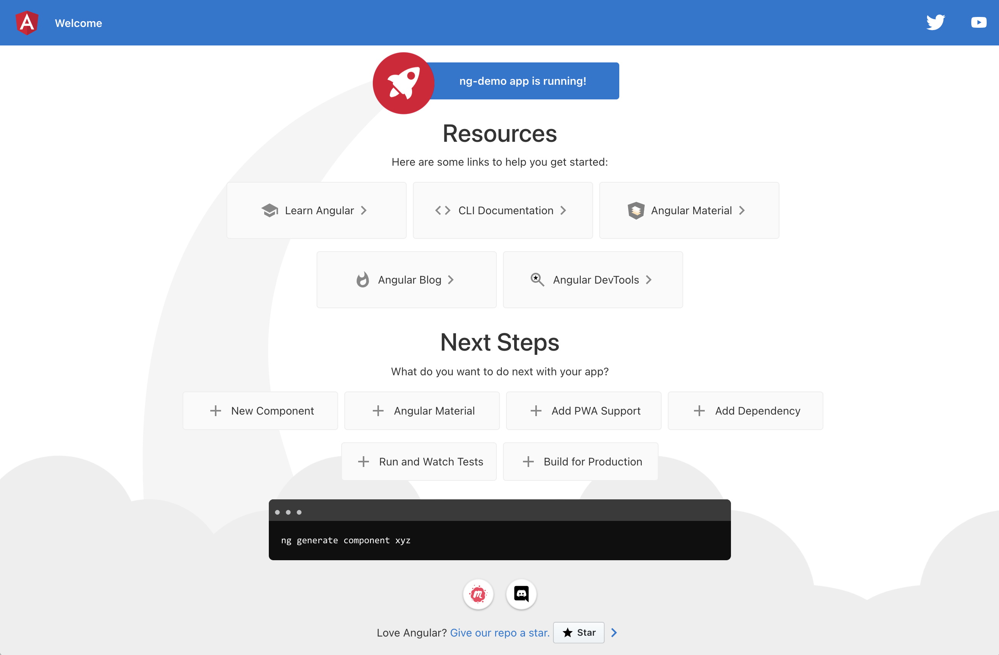
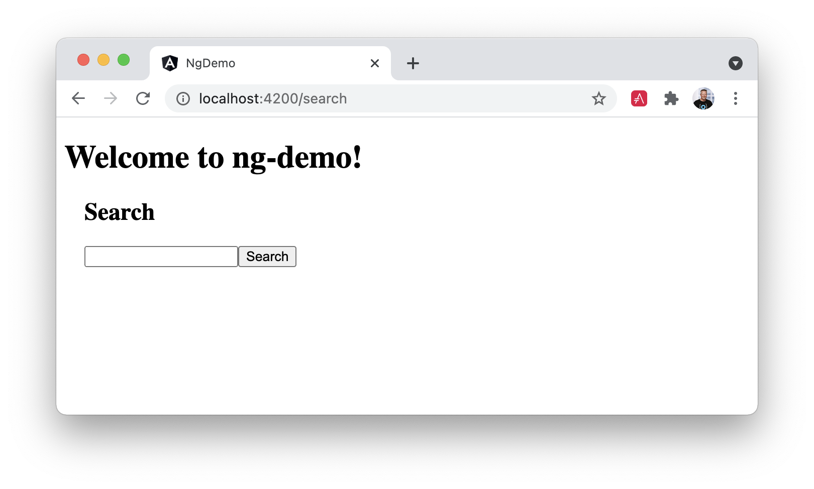
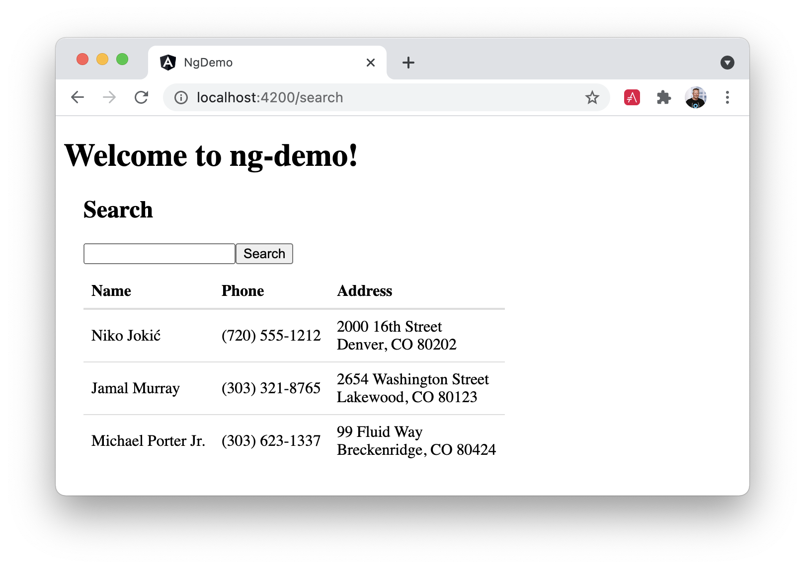
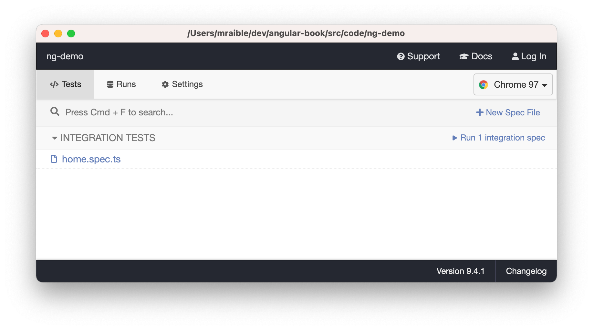
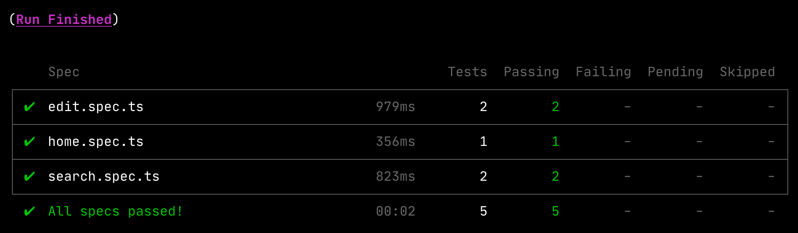

= Build an Angular App

I was immediately attracted to Angular when I saw its separation of concerns. It recommended organizing your application into several distinct types of :

* Modules: A mechanism to organize related code into functional sets.
* Components: Classes that retrieve data from services and expose it to templates.
* Services: Classes that make HTTP calls to APIs.
* Templates: HTML pages that display data. Use Angular directives to iterate over collections and show/hide elements.
* Pipes: Data-manipulation tools that can transform data (e.g. uppercase, lowercase, ordering, and searching).
* Directives: HTML processors that allow manipulate data before it's displayed.

== A Brief History of Angular

AngularJS was started by Miško Hevery in 2009. He was working on a project that was using GWT (Google Web Toolkit). Three developers had been developing the product for six months, and Miško rewrote the whole thing in AngularJS in three weeks. At that time, AngularJS was a side project he'd created. It didn't require you to write much in JavaScript as you could program most of the logic in HTML. The GWT version of the product contained 17,000 lines of code. The AngularJS version was only 1,000 lines of code!

In October 2014, the AngularJS team announced they were building http://www.infoq.com/news/2014/10/angular-2-atscript[Angular 2.0]. The announcement led to a bit of upheaval in the Angular developer community. The API for writing Angular applications was going to change and it was to be based on a new language, AtScript. There would be no migration path and users would have to continue using 1.x or rewrite their applications for 2.x.

In March 2015, the Angular team http://www.infoq.com/news/2015/03/angular-2-concerns-addressed[addressed community concerns], announcing that they would be using TypeScript over AtScript and that they would provide a migration path for Angular 1.x users. They also adopted semantic versioning and http://angularjs.blogspot.com/2017/01/branding-guidelines-for-angular-and.html[recommended people call it "Angular" instead of Angular 2.0].

Angular 2.0 was released September 2016. Angular 4.0 was released March 2017. The Angular project tries to release two major versions each year to keep Angular synchronized with the rest of the JavaScript ecosystem and to have a predictable schedule. They released Angular 12 on May 12, 2021.

You can find the Angular project at https://angular.io[angular.io].

Developers like to see things working in minutes. I'm a developer and I like to evaluate software with a "10-minute test". If I can get it working in 10 minutes, sign me up!

Rather than explain all the concepts in Angular, I prefer to show you how it works. In this chapter, I'll show you how to build a basic Angular application.

Along the way, I'll show you how to unit test your Angular components, and deploy to production.

NOTE: I should warn you about my teaching style. I'll show how to do things and errors will happen. You'll think you did something wrong. However, if you return to my instructions, you'll find that error was expected. When you see errors happen, make sure to keep reading. 🙂

**Prerequisites:**

* A favorite text editor or IDE. I recommend https://www.jetbrains.com/idea/[IntelliJ IDEA].
* http://nodejs.org/[Node.js] and npm installed.
* https://angular.io/cli[Angular CLI] installed. If you don't have the Angular CLI installed, install it using `npm install -g @angular/cli@12`.

== Create a new Angular project

Create a new project using the `ng new` command:

----
ng new ng-demo
----

When prompted to install Angular routing, type "Y". For the stylesheet format, choose "CSS" (the default).

This will create a `ng-demo` project and run `npm install` in it. It takes about a minute to complete, but will vary based on your internet connection speed.

You can see the version of Angular CLI you're using with `ng version`.

----
$ ng version

     _                      _                 ____ _     ___
    / \   _ __   __ _ _   _| | __ _ _ __     / ___| |   |_ _|
   / △ \ | '_ \ / _` | | | | |/ _` | '__|   | |   | |    | |
  / ___ \| | | | (_| | |_| | | (_| | |      | |___| |___ | |
 /_/   \_\_| |_|\__, |\__,_|_|\__,_|_|       \____|_____|___|
                |___/

Angular CLI: 12.0.0-rc.1
Node: 14.16.1
Package Manager: npm 7.11.2
OS: darwin x64

Angular: undefined
...

Package                      Version
------------------------------------------------------
@angular-devkit/architect    0.1200.0-rc.1 (cli-only)
@angular-devkit/core         12.0.0-rc.1 (cli-only)
@angular-devkit/schematics   12.0.0-rc.1 (cli-only)
@schematics/angular          12.0.0-rc.1 (cli-only)
----

If you run this command from the `ng-demo` directory, you'll see even more information.

----
     _                      _                 ____ _     ___
    / \   _ __   __ _ _   _| | __ _ _ __     / ___| |   |_ _|
   / △ \ | '_ \ / _` | | | | |/ _` | '__|   | |   | |    | |
  / ___ \| | | | (_| | |_| | | (_| | |      | |___| |___ | |
 /_/   \_\_| |_|\__, |\__,_|_|\__,_|_|       \____|_____|___|
                |___/

Angular CLI: 12.0.0-rc.1
Node: 14.16.1
Package Manager: npm 7.11.2
OS: darwin x64

Angular: 12.0.0-rc.1
... animations, cli, common, compiler, compiler-cli, core, forms
... platform-browser, platform-browser-dynamic, router

Package                         Version
---------------------------------------------------------
@angular-devkit/architect       0.1200.0-rc.1
@angular-devkit/build-angular   12.0.0-rc.1
@angular-devkit/core            12.0.0-rc.1
@angular-devkit/schematics      12.0.0-rc.1
@schematics/angular             12.0.0-rc.1
rxjs                            6.6.7
typescript                      4.2.4
----

== Run the application

The project is configured with a simple web server for development. To start it, run:

----
ng serve
----

You should see a screen like the one below at `http://localhost:4200`.

[[default-homepage]]
.Default homepage

You can make sure your new project's tests pass, run `ng test`:

----
$ ng test
...
Chrome 90.0.4430.93 (Mac OS 10.15.7): Executed 3 of 3 SUCCESS (0.2 secs / 0.144 secs)
----

== Add a search feature

To add a search feature, open the project in an IDE or your favorite text editor.

=== The Basics

In a terminal window, cd into your project's directory and run the following command to create a search component.

[source]
----
ng g component search
----

Open `src/app/search/search.component.html` and replace its default HTML with the following:

[source,html]
.src/app/search/search.component.html
----
<h2>Search</h2>
<form>
  <input type="search" name="query" [(ngModel)]="query" (keyup.enter)="search()">
  <button type="button" (click)="search()">Search</button>
</form>
<pre>{{searchResults | json}}</pre>
----

If you try to start your app at this point, you'll receive a compilation error.

----
ERROR in src/app/search/search.component.html:3:50 - error TS2339:
 Property 'query' does not exist on type 'SearchComponent'.
----

To fix this, add a `query` property to `src/app/search/search.component.ts`. While you're there, add a `searchResults` property and an empty `search()` method.

[source,typescript]
.src/app/search/search.component.ts
----
export class SearchComponent implements OnInit {
  query: string | undefined;
  searchResults: any;

  constructor() { }

  ngOnInit(): void { }

  search(): void { }

}
----

=== Adding a Search Route

The https://angular.io/guide/router[Router and navigation docs] for Angular provides the information you need to set up a route to the `SearchComponent` you just generated. Here's a quick summary:

In `src/app/app-routing.module.ts`, modify the `routes` constant to add `SearchComponent` as the default:

[source,typescript]
.src/app/app-routing.module.ts
----
import { SearchComponent } from './search/search.component';

const routes: Routes = [
  { path: 'search', component: SearchComponent },
  { path: '', redirectTo: '/search', pathMatch: 'full' }
];
----

Run `ng serve` again you will see a compilation error.

----
ERROR in src/app/search/search.component.html:3:37 - error NG8002:
 Can't bind to 'ngModel' since it isn't a known property of 'input'.
----

To solve this, open `src/app/app.module.ts` and add `FormsModule` as an import in `@NgModule`:

[source,typescript]
.src/app/app.module.ts
----
import { FormsModule } from '@angular/forms';

@NgModule({
  ...
  imports: [
    ...
    FormsModule
  ]
  ...
})
export class AppModule { }
----

Now you should be able to see the search form.

[[search-component]]
.Search component

If yours looks different, it's because I trimmed my `app.component.html` to the bare minimum.

[source,html]
.src/app/app.component.html
----
<h1>Welcome to {{ title }}!</h1>

<router-outlet></router-outlet>
----

If you want to add CSS for this component, open `src/app/search/search.component.css` and add some CSS. For example:

[source,css]
.src/app/search/search.component.css
----
:host {
  display: block;
  padding: 0 20px;
}
----

This section has shown you how to generate a new component and add it to a basic Angular application with Angular CLI. The next section shows you how to create and use a JSON file and `localStorage` to create a fake API.

=== The Backend

To get search results, create a `SearchService` that makes HTTP requests to a JSON file. Start by generating a new service.

----
ng g service shared/search/search
----

Create `src/assets/data/people.json` to hold your data.

----
mkdir -p src/assets/data
----

[source,json]
.src/assets/data/people.json
----
[
  {
    "id": 1,
    "name": "Nikola Jokić",
    "phone": "(720) 555-1212",
    "address": {
      "street": "2000 16th Street",
      "city": "Denver",
      "state": "CO",
      "zip": "80202"
    }
  },
  {
    "id": 2,
    "name": "Jamal Murray",
    "phone": "(303) 321-8765",
    "address": {
      "street": "2654 Washington Street",
      "city": "Lakewood",
      "state": "CO",
      "zip": "80123"
    }
  },
  {
    "id": 3,
    "name": "Michael Porter Jr.",
    "phone": "(303) 623-1337",
    "address": {
      "street": "99 Fluid Way",
      "city": "Breckenridge",
      "state": "CO",
      "zip": "80424"
    }
  }
]
----

Modify `src/app/shared/search/search.service.ts` and provide `HttpClient` as a dependency in its constructor.

In this same file, create a `getAll()` method to gather all the people. Also, define the `Address` and `Person` classes that JSON will be marshalled to.

[source,typescript]
.src/app/shared/search/search.service.ts
----
import { Injectable } from '@angular/core';
import { HttpClient } from '@angular/common/http';

@Injectable({
  providedIn: 'root'
})
export class SearchService {

  constructor(private http: HttpClient) { }

  getAll() {
    return this.http.get('assets/data/people.json');
  }
}

export class Address {
  street: string;
  city: string;
  state: string;
  zip: string;

  constructor(obj?: any) {
    this.street = obj && obj.street || null;
    this.city = obj && obj.city || null;
    this.state = obj && obj.state || null;
    this.zip = obj && obj.zip || null;
  }
}

export class Person {
  id: number;
  name: string;
  phone: string;
  address: Address;

  constructor(obj?: any) {
    this.id = obj && Number(obj.id) || null;
    this.name = obj && obj.name || null;
    this.phone = obj && obj.phone || null;
    this.address = obj && obj.address || null;
  }
}
----

To make these classes easier to consume by your components, create `src/app/shared/index.ts` and add the following:

[source,typescript]
.src/app/shared/index.ts
----
export * from './search/search.service';
----

The reason for creating this file is so you can import multiple classes on a single line rather than having to import each individual class on separate lines.

In `search.component.ts`, add imports for these classes.

[source,typescript]
.src/app/search/search.component.ts
----
import { Person, SearchService } from '../shared';
----

You can now add a proper type to the `searchResults` variable. While you're there, modify the constructor to inject the `SearchService`.

[source,typescript]
.src/app/search/search.component.ts
----
export class SearchComponent implements OnInit {
  query: string | undefined;
  searchResults: Array<Person> = [];

  constructor(private searchService: SearchService) { }
----

Then update the `search()` method to call the service's `getAll()` method.

[source,typescript]
.src/app/search/search.component.ts
----
search(): void {
  this.searchService.getAll().subscribe(
    (data: any) => { this.searchResults = data; },
    error => console.log(error)
  );
}
----

At this point, you'll likely see the following message in your browser's console.

----
NullInjectorError: No provider for HttpClient!
----

To fix the "No provider" error from above, update `app.module.ts` to import `HttpClientModule`.

[source,typescript]
.src/app/app.module.ts
----
import { HttpClientModule } from '@angular/common/http';

@NgModule({
  ...
  imports: [
    ...
    HttpClientModule
  ],
  providers: [],
  bootstrap: [AppComponent]
})
----

Now clicking the search button should work. To make the results look better, remove the `<pre>` tag and replace it with a `<table>` in `search.component.html`.

[source,xml]
.src/app/search/search.component.html
----
<table *ngIf="searchResults?.length">
  <thead>
  <tr>
    <th>Name</th>
    <th>Phone</th>
    <th>Address</th>
  </tr>
  </thead>
  <tbody>
  <tr *ngFor="let person of searchResults; let i=index">
    <td>{{person.name}}</td>
    <td>{{person.phone}}</td>
    <td>{{person.address.street}} 
      {{person.address.city}}, {{person.address.state}} {{person.address.zip}}
    </td>
  </tr>
  </tbody>
</table>
----

.What's up with `*ngIf` and `.?`
****
You might be asking yourself why there's an asterisk in front of `ngIf`. From https://angular.io/docs/ts/latest/guide/structural-directives#asterisk[Angular's docs]:

> Angular transforms the asterisk in front of a structural directive into an `<ng-template>` that surrounds the host element and its descendants.

These two HTML snippets render the same output:

[source,html]
----

  Not all heroes wear capes!

<template [ngIf]="condition">
  

    Not all heroes wear capes!
  

</template>
----

As far as the `.?` is concerned, that's how you do null-safe property traversal in TypeScript. It's officially called https://www.typescriptlang.org/docs/handbook/release-notes/typescript-3-7.html[optional chaining] and was introduced in TypeScript 3.7.
****

Then add some additional CSS to `search.component.css` to improve its table layout.

[source,css]
.src/app/search/search.component.css
----
table {
  margin-top: 10px;
  border-collapse: collapse;
}

th {
  text-align: left;
  border-bottom: 2px solid #ddd;
  padding: 8px;
}

td {
  border-top: 1px solid #ddd;
  padding: 8px;
}
----

Now the search results look better.

[[search-results]]
.Search results

But wait, you still don't have search functionality! To add a search feature, add a `search()` method to `SearchService`.

[source,typescript]
.src/app/shared/search/search.service.ts
----
import { Observable } from 'rxjs';
import { map } from 'rxjs/operators';
...

  search(q: string): Observable<any> {
    if (!q || q === '*') {
      q = '';
    } else {
      q = q.toLowerCase();
    }
    return this.getAll().pipe(
      map((data: any) => data
        .filter((item: Person) => JSON.stringify(item).toLowerCase().includes(q)))
    );
  }
----

Then refactor `SearchComponent` to call this method with its `query` variable.

[source,typescript]
.src/app/search/search.component.ts
----
search(): void {
  this.searchService.search(this.query).subscribe(
    (data: any) => { this.searchResults = data; },
    error => console.log(error)
  );
}
----

This won't compile right away.

[source,shell]
----
Error: src/app/search/search.component.ts:18:31 - error TS2345:
 Argument of type 'string | undefined' is not assignable to parameter of type 'string'.
----

Since `query` will always be assigned (even if it's empty), change its variable declaration to.

[source,ts]
----
query!: string; // query: string = ''; will also work
----

This is called a https://www.typescriptlang.org/docs/handbook/release-notes/typescript-2-7.html#definite-assignment-assertions[definite assignment assertion]. It's a way to tell TypeScript "I know what I'm doing, the variable will be assigned."

Now search results will be filtered by the query value you type in.

This section showed you how to fetch and display search results. The next section builds on this and shows how to edit and save a record.

== Add an edit feature

Modify `search.component.html` to wrap the person's name with a link.

[source,html]
.src/app/search/search.component.html
----
<td><a [routerLink]="['/edit', person.id]">{{person.name}}</a></td>
----

Run the following command to generate an `EditComponent`.

[source]
----
ng g component edit
----

Add a route for this component in `app-routing.module.ts`:

[source,typescript]
.src/app/app-routing.module.ts
----
import { EditComponent } from './edit/edit.component';

const routes: Routes = [
  { path: 'search', component: SearchComponent },
  { path: 'edit/:id', component: EditComponent },
  { path: '', redirectTo: '/search', pathMatch: 'full' }
];
----

Update `src/app/edit/edit.component.html` to display an editable form. You might notice I've added `id` attributes to most elements. This is to make it easier to locate elements when writing integration tests.

[source,html]
.src/app/edit/edit.component.html
----

  <h3>{{editName}}</h3>
  

    <label>Id:</label>
    {{person.id}}
  

  

    <label>Name:</label>
    <input [(ngModel)]="editName" name="name" id="name" placeholder="name"/>
  

  

    <label>Phone:</label>
    <input [(ngModel)]="editPhone" name="phone" id="phone" placeholder="Phone"/>
  

  <fieldset>
    <legend>Address:</legend>
    <address>
      <input [(ngModel)]="editAddress.street" id="street"> 
      <input [(ngModel)]="editAddress.city" id="city">,
      <input [(ngModel)]="editAddress.state" id="state" size="2">
      <input [(ngModel)]="editAddress.zip" id="zip" size="5">
    </address>
  </fieldset>
  <button (click)="save()" id="save">Save</button>
  <button (click)="cancel()" id="cancel">Cancel</button>

----

Modify `EditComponent` to import model and service classes and to use the `SearchService` to get data.

[source,typescript]
.src/app/edit/edit.component.ts
----
import { Component, OnInit, OnDestroy } from '@angular/core';
import { Address, Person, SearchService } from '../shared';
import { Subscription } from 'rxjs';
import { ActivatedRoute, Router } from '@angular/router';

@Component({
  selector: 'app-edit',
  templateUrl: './edit.component.html',
  styleUrls: ['./edit.component.css']
})
export class EditComponent implements OnInit, OnDestroy {
  person!: Person;
  editName!: string;
  editPhone!: string;
  editAddress!: Address;

  sub!: Subscription;

  constructor(private route: ActivatedRoute,
              private router: Router,
              private service: SearchService) {
  }

  ngOnInit(): void {
    this.sub = this.route.params.subscribe(params => {
      const id = + params.id; // (+) converts string 'id' to a number
      this.service.get(id).subscribe(person => {
        if (person) {
          this.editName = person.name;
          this.editPhone = person.phone;
          this.editAddress = person.address;
          this.person = person;
        } else {
          this.gotoList();
        }
      });
    });
  }

  ngOnDestroy(): void {
    if (this.sub) {
      this.sub.unsubscribe();
    }
  }

  cancel() {
    this.router.navigate(['/search']);
  }

  save() {
    this.person.name = this.editName;
    this.person.phone = this.editPhone;
    this.person.address = this.editAddress;
    this.service.save(this.person);
    this.gotoList();
  }

  gotoList() {
    if (this.person) {
      this.router.navigate(['/search', {term: this.person.name} ]);
    } else {
      this.router.navigate(['/search']);
    }
  }
}
----

Modify `SearchService` to contain functions for finding a person by their id, and saving them. While you're in there, modify the `search()` method to be aware of updated objects in `localStorage`.

[source,typescript]
.src/app/shared/search/search.service.ts
----
search(q: string): Observable<any> {
  if (!q || q === '*') {
    q = '';
  } else {
    q = q.toLowerCase();
  }
  return this.getAll().pipe(
    map((data: any) => data
      .map((item: Person) => !!localStorage['person' + item.id] ?
        JSON.parse(localStorage['person' + item.id]) : item)
      .filter((item: Person) => JSON.stringify(item).toLowerCase().includes(q))
    ));
}

get(id: number) {
  return this.getAll().pipe(map((all: any) => {
    if (localStorage['person' + id]) {
      return JSON.parse(localStorage['person' + id]);
    }
    return all.find((e: Person) => e.id === id);
  }));
}

save(person: Person) {
  localStorage['person' + person.id] = JSON.stringify(person);
}
----

You can add CSS to `src/app/edit/edit.component.css` if you want to make the form look a bit better.

[source,css]
.src/app/edit/edit.component.css
----
:host {
  display: block;
  padding: 0 20px;
}

button {
  margin-top: 10px;
}
----

At this point, you should be able to search for a person and update their information.

[[edit-form]]
.Edit component

The &lt;form> in `src/app/edit/edit.component.html` calls a `save()` function to update a person's data. You already implemented this above. The function calls a `gotoList()` function that appends the person's name to the URL when sending the user back to the search screen.

[source,typescript]
.src/app/edit/edit.component.ts
----
gotoList() {
  if (this.person) {
    this.router.navigate(['/search', {term: this.person.name} ]);
  } else {
    this.router.navigate(['/search']);
  }
}
----

Since the `SearchComponent` doesn't execute a search automatically when you execute this URL, add the following logic to do so in its `ngOnInit()` method.

[source,typescript]
.src/app/search/search.component.ts
----
import { ActivatedRoute } from '@angular/router';
import { Subscription } from 'rxjs';
...

sub!: Subscription;

constructor(private searchService: SearchService, private route: ActivatedRoute) { }

  ngOnInit(): void {
    this.sub = this.route.params.subscribe(params => {
      if (params.term) {
        this.query = decodeURIComponent(params.term);
        this.search();
      }
    });
  }
----

You'll want to implement `OnDestroy` and define the `ngOnDestroy` method to clean up this subscription.

[source,typescript]
.src/app/search/search.component.ts
----
import { Component, OnDestroy, OnInit } from '@angular/core';

export class SearchComponent implements OnInit, OnDestroy {
...
  ngOnDestroy(): void {
    if (this.sub) {
      this.sub.unsubscribe();
    }
  }
}
----

After making all these changes, you should be able to search/edit/update a person's information. If it works - nice job!

=== Add Form Validation

One thing you might notice is you can clear any input element in the form and save it. At the very least, the `name` field should be required. Otherwise, there's nothing to click on in the search results.

To make name required, modify `edit.component.html` to add a `required` attribute to the name `<input>` and bind it to Angular's validation with `#name="ngModel"`. Add a `
` next to the field to display an error message when validation fails.

[source,html]
.src/app/edit/edit.component.html
----
<input [(ngModel)]="editName" name="name" id="name" placeholder="name" required #name="ngModel"/>

  Name is required

----

You'll also need to wrap everything in a `<form>` element. Add `<form>` after the `<h3>` tag and close it before the last `
`. You'll also need to add an `(ngSubmit)` handler to the form, give it a name of `editForm`, and change the save button to be a regular submit button that's disabled when the form is invalid.

[source,html]
.src/app/edit/edit.component.html
----
<h3>{{editName}}</h3>
<form (ngSubmit)="save()" #editForm="ngForm">
  ...
  <button type="submit" id="save" [disabled]="!editForm.form.valid">Save</button>
  <button (click)="cancel()" id="cancel">Cancel</button>
</form>
----

After making these changes, the name field will be required.

[[edit-form-required]]
.Edit form with validation

In this screenshot, you might notice the address fields are blank and the save button is enabled. This is explained by the error in your console.

----
If ngModel is used within a form tag, either the name attribute must be set or the form control must be defined as 'standalone' in ngModelOptions.

Example 1: <input [(ngModel)]="person.firstName" name="first">
Example 2: <input [(ngModel)]="person.firstName" [ngModelOptions]="{standalone: true}">
----

To fix, add a `name` attribute to all the address fields. For example:

[source,html]
.src/app/edit/edit.component.html
----
<address>
  <input [(ngModel)]="editAddress.street" name="street" id="street"> 
  <input [(ngModel)]="editAddress.city" name="city" id="city">,
  <input [(ngModel)]="editAddress.state" name="state" id="state" size="2">
  <input [(ngModel)]="editAddress.zip" name="zip" id="zip" size="5">
</address>
----

Now values display in all fields, `name` is required, and save is enabled.

[[edit-form-names]]
.Edit form with names and validation

To learn more about forms and validation, see https://angular.io/guide/form-validation[Angular Forms Validation documentation].

== Test your Angular app

Now that you've built an application, it's important to test it to ensure it works. The best reason for writing tests is to automate your testing. Without tests, you'll likely be testing manually. This manual testing will take longer and longer as your application grows.

In this section, you'll learn to use http://jasmine.github.io/[Jasmine] for unit testing controllers and https://www.cypress.io/[Cypress] for integration testing. Angular's testing documentation lists many https://angular.io/guide/testing[good reasons] to test.

=== Fix the Tests

If you run `ng test`, you'll likely get failures for the components and service you created. These failures will be solved as you complete the section below. The `ng test` command will start a process that listens for changes so all you need to do is edit/save files and tests will be automatically run again.

TIP: You can use `x` and `f` prefixes in front of `describe` and `it` functions to _exclude_ or _only_ run a particular test.

=== Fix the `AppComponent` test

If you changed the `app.component.html` template like I did, you'll need to modify `app.component.spec.ts` to account for the change in HTML. Change its last test to look for an `<h1>` element and the welcome message inside it.

[source,ts]
.src/app/app/app.component.spec.ts
----
it('should render title', () => {
  const fixture = TestBed.createComponent(AppComponent);
  fixture.detectChanges();
  const compiled = fixture.nativeElement;
  expect(compiled.querySelector('h1').textContent).toContain('Welcome to ng-demo!');
});
----

Now this test should pass.

=== Unit test the SearchService

Modify `src/app/shared/search/search.service.spec.ts` and setup the test's infrastructure (a.k.a. `TestBed`) using `HttpClientTestingModule` and `HttpTestingController`.

[source,typescript]
.src/app/shared/search/search.service.spec.ts
----
import { TestBed } from '@angular/core/testing';
import { SearchService } from './search.service';
import { HttpClientTestingModule, HttpTestingController } from '@angular/common/http/testing';

describe('SearchService', () => {
  let service: SearchService;
  let httpMock: HttpTestingController;

  beforeEach(() => {
    TestBed.configureTestingModule({
      imports: [HttpClientTestingModule],
      providers: [SearchService]
    });

    service = TestBed.inject(SearchService);
    httpMock = TestBed.inject(HttpTestingController);
  });

  it('should be created', () => {
    expect(service).toBeTruthy();
  });
});
----

If you run `ng test`, you will likely see some errors about the test stubs that Angular CLI created for you. You can ignore these for now.

----
NullInjectorError: R3InjectorError(DynamicTestModule)[SearchService -> HttpClient -> HttpClient]:
  NullInjectorError: No provider for HttpClient!

NullInjectorError: R3InjectorError(DynamicTestModule)[ActivatedRoute -> ActivatedRoute]:
  NullInjectorError: No provider for ActivatedRoute!
----

`HttpTestingController` allows you to mock requests and use its `flush()` method to provide response values. Since the HTTP request methods return an `Observable`, you can subscribe to it and create expectations in the callback methods. Add the first test of `getAll()` to `search.service.spec.ts`.

The test below should be on the same level as `beforeEach`.

[source,typescript]
.src/app/shared/search/search.service.spec.ts
----
it('should retrieve all search results', () => {
  const mockResponse = [
    {name: 'Nikola Jokić'},
    {name: 'Mike Malone'}
  ];

  service.getAll().subscribe((people: any) => {
    expect(people.length).toBe(2);
    expect(people[0].name).toBe('Nikola Jokić');
    expect(people).toEqual(mockResponse);
  });

  const req = httpMock.expectOne('assets/data/people.json');
  expect(req.request.method).toBe('GET');
  req.flush(mockResponse);
});
----

While you're there, add an `afterEach()` to verify requests.

[source,typescript]
.src/app/shared/search/search.service.spec.ts
----
afterEach(() => {
  httpMock.verify();
});
----

Add a couple more tests for filtering by search term and fetching by id.

[source,typescript]
.src/app/shared/search/search.service.spec.ts
----
it('should filter by search term', () => {
  const mockResponse = [{name: 'Nikola Jokić'}];

  service.search('nik').subscribe((people: any) => {
    expect(people.length).toBe(1);
    expect(people[0].name).toBe('Nikola Jokić');
  });

  const req = httpMock.expectOne('assets/data/people.json');
  expect(req.request.method).toBe('GET');
  req.flush(mockResponse);
});

it('should fetch by id', () => {
  const mockResponse = [
    {id: 1, name: 'Nikola Jokić'},
    {id: 2, name: 'Mike Malone'}
  ];

  service.get(2).subscribe((person: any) => {
    expect(person.name).toBe('Mike Malone');
  });

  const req = httpMock.expectOne('assets/data/people.json');
  expect(req.request.method).toBe('GET');
  req.flush(mockResponse);
});
----

=== Unit test the SearchComponent

To unit test the `SearchComponent`, you can mock the methods in `SearchService` with http://angular-tips.com/blog/2014/03/introduction-to-unit-test-spies/[spies]. These allow you to _spy_ on functions to check if they were called.

Create `src/app/shared/search/mocks/routes.ts` to mock Angular's `Router` and `ActivatedRoute`.

[source,typescript]
.src/app/shared/search/mocks/routes.ts
----
import { ActivatedRoute, Params } from '@angular/router';
import { Observable, of } from 'rxjs';

export class MockActivatedRoute extends ActivatedRoute {
  params: Observable<Params>;

  constructor(parameters?: { [key: string]: any; }) {
    super();
    // @ts-ignore
    this.params = of(parameters);
  }
}

export class MockRouter {
  navigate = jasmine.createSpy('navigate');
}
----

With this mock in place, you can `TestBed.configureTestingModule()` to setup `SearchComponent` to use it as a provider. In the second `beforeEach()`, you can see that the `search()` method is spied on and its results are mocked. The response isn't important in this case because you're just unit testing the `SearchComponent`.

[source,typescript]
.src/app/search/search.component.spec.ts
----
import { ComponentFixture, TestBed } from '@angular/core/testing';
import { SearchComponent } from './search.component';
import { SearchService } from '../shared';
import { ActivatedRoute } from '@angular/router';
import { RouterTestingModule } from '@angular/router/testing';
import { FormsModule } from '@angular/forms';
import { MockActivatedRoute } from '../shared/search/mocks/routes';
import { of } from 'rxjs';
import { HttpClientTestingModule } from '@angular/common/http/testing';

describe('SearchComponent', () => {
  let component: SearchComponent;
  let fixture: ComponentFixture<SearchComponent>;
  let mockSearchService: SearchService;
  let mockActivatedRoute: MockActivatedRoute;

  beforeEach((() => {
    mockActivatedRoute = new MockActivatedRoute({term: 'nikola'});

    TestBed.configureTestingModule({
      declarations: [SearchComponent],
      providers: [
        {provide: ActivatedRoute, useValue: mockActivatedRoute}
      ],
      imports: [FormsModule, RouterTestingModule, HttpClientTestingModule]
    }).compileComponents();
  }));

  beforeEach(() => {
    // mock response
    mockSearchService = TestBed.inject(SearchService);
    mockSearchService.search = jasmine.createSpy().and.returnValue(of([]));

    // initialize component
    fixture = TestBed.createComponent(SearchComponent);
    component = fixture.componentInstance;
    fixture.detectChanges();
  });

  it('should create', () => {
    expect(component).toBeTruthy();
  });
});
----

Add two tests, one to verify a search term is used when it's set on the component, and a second to verify search is called when a term is passed in as a route parameter.

[source,typescript]
.src/app/search/search.component.spec.ts
----
it('should search when a term is set and search() is called', () => {
  component = fixture.debugElement.componentInstance;
  component.query = 'J';
  component.search();
  expect(mockSearchService.search).toHaveBeenCalledWith('J');
});

it('should search automatically when a term is on the URL', () => {
  fixture.detectChanges();
  expect(mockSearchService.search).toHaveBeenCalledWith('nikola');
});
----

Update the test for `EditComponent`, verifying fetching a single record works. Notice how you can access the component directly with `fixture.componentInstance`, or its rendered version with `fixture.nativeElement`.

[source,typescript]
.src/app/edit/edit.component.spec.ts
----
import { EditComponent } from './edit.component';
import { TestBed } from '@angular/core/testing';
import { Address, Person, SearchService } from '../shared';
import { MockActivatedRoute, MockRouter } from '../shared/search/mocks/routes';
import { ActivatedRoute, Router } from '@angular/router';
import { FormsModule } from '@angular/forms';
import { of } from 'rxjs';
import { HttpClientTestingModule } from '@angular/common/http/testing';

describe('EditComponent', () => {
  let mockSearchService: SearchService;
  let mockActivatedRoute: MockActivatedRoute;
  let mockRouter: MockRouter;

  beforeEach(() => {
    mockActivatedRoute = new MockActivatedRoute({id: 1});
    mockRouter = new MockRouter();

    TestBed.configureTestingModule({
      declarations: [EditComponent],
      providers: [
        {provide: ActivatedRoute, useValue: mockActivatedRoute},
        {provide: Router, useValue: mockRouter}
      ],
      imports: [FormsModule, HttpClientTestingModule]
    }).compileComponents();

    mockSearchService = TestBed.inject(SearchService);
  });

  it('should fetch a single record', () => {
    const fixture = TestBed.createComponent(EditComponent);

    const person = new Person({id: 1, name: 'Michael Porter Jr.'});
    person.address = new Address({city: 'Denver'});

    // mock response
    spyOn(mockSearchService, 'get').and.returnValue(of(person));

    // initialize component
    fixture.detectChanges();

    // verify service was called
    expect(mockSearchService.get).toHaveBeenCalledWith(1);

    // verify data was set on component when initialized
    const editComponent = fixture.componentInstance;
    expect(editComponent.editAddress.city).toBe('Denver');

    // verify HTML renders as expected
    const compiled = fixture.nativeElement;
    expect(compiled.querySelector('h3').innerHTML).toBe('Michael Porter Jr.');
  });
});
----

You should see "Executed 11 of 11 [green]#SUCCESS# (0.224 secs / 0.164 secs)" in the shell window that's running `ng test`. If you don't, try cancelling the command and restarting.

=== Integration test the search UI

To test if the application works end-to-end, you can write tests with http://www.cypress.io/[Cypress]. These are also known as integration tests, since they test the _integration_ between all layers of your application.

If you're an experienced Angular developer, you might be wondering, "What happened to Protractor?" Protractor support was https://github.com/angular/protractor/issues/5502[removed in Angular 12] and other options such as Cypress, WebdriverIO, and TestCafe are being considered for future versions.

TIP: If you're experienced with Protractor, see https://docs.cypress.io/guides/migrating-to-cypress/protractor[Migrating from Protractor to Cypress].

You can use the official https://www.npmjs.com/package/@cypress/schematic[Cypress Angular Schematic] to add Cypress to your Angular project.

----
ng add @cypress/schematic
----

This will add Cypress as a dependency and create configuration files to work with Angular and TypeScript. Rename `cypress/integration/spec.ts` to `home.spec.ts` and change it to look for the title of your app.

[source,ts]
.cypress/integration/home.spec.ts
----
describe('Home', () => {
  it('Visits the initial project page', () => {
    cy.visit('/')
    cy.contains('Welcome to ng-demo!')
    cy.contains('Search')
  })
})
----

Then, run `ng e2e`. This will compile your app, start in on `http://localhost:4200`, and launch the Cypress app.

[[cypress-app]]
.Edit form with names and validation

If you click on the file name, it'll launch a browser and run the test. You can use this feature to step through your tests, find selectors for elements, and much more. You can learn more about Cypress's features in https://armno.in.th/2020/02/26/cypress-angular-integration-testing/[Setting up Cypress for an Angular Project].

Personally, I prefer the Protractor experience where you could just run the command, it'd run all the tests, and the user doesn't need to interact. You can do this with Cypress too!

The Cypress Angular Schematic added a few scripts to your `package.json`:

[source,json]
----
"scripts": {
  ...
  "e2e": "ng e2e",
  "cypress:open": "cypress open",
  "cypress:run": "cypress run"
}
----

To use the no-interaction approach, you'll need to start your app:

----
npm start
----

Then, run the Cypress tests for it in another window:

----
npm run cypress:run
----

TIP: You might notice Cypress creates a video. You can disable this by adding `"video": false` to your `cypress.json` file.

The `npm run cypress:run` command will run a headless browser, so you won't see anything happening on your screen.

If you want to see the tests run, append `--browser chrome` to the command. Add this to your `package.json` if you want to make it the default. See Cypress's https://docs.cypress.io/guides/guides/launching-browsers[launching browsers] documentation to see a list of supported browsers.

You can also install https://www.npmjs.com/package/concurrently[concurrently] so you can run multiple tasks with one command.

[source,shell]
----
npm install -D concurrently
----

Then, add a `cy:run` script to your `package.json`:

[source,json]
----
"scripts": {
  ...
  "cy:run": "concurrently \"ng serve\" \"cypress run\""
}
----

Then, you can run `npm run cy:run` to start your app and continuously run end-to-end tests on it when you change files.

=== Testing the search feature

Create another end-to-end tests in `cypress/integration/search.spec.ts` to verify the search feature works. Populate it with the following code:

[source,typescript]
.cypress/integration/search.spec.ts
----
describe('Search', () => {

  beforeEach(() => {
    cy.visit('/')
  });

  it('should have an input and search button', () => {
    cy.get('app-root app-search form input').should('exist');
    cy.get('app-root app-search form button').should('exist');
  });

  it('should allow searching', () => {
    cy.get('input').type('A');
    cy.get('button').click();
    const list = cy.get('app-search table tbody tr');
    list.should('have.length', 3);
  });
});
----

=== Testing the edit feature

Create a `cypress/integration/edit.spec.ts` test to verify the `EditComponent` renders a person's information and that their information can be updated.

[source,typescript]
.cypress/integration/edit.spec.ts
----
describe('Edit', () => {

  beforeEach(() => {
    cy.visit('/edit/1')
  });

  it('should allow viewing a person',  () => {
    cy.get('h3').should('have.text', 'Nikola Jokić');
    cy.get('#name').should('have.value', 'Nikola Jokić');
    cy.get('#street').should('have.value', '2000 16th Street');
    cy.get('#city').should('have.value', 'Denver');
  });

  it('should allow updating a name', () => {
    cy.get('#name').type(' Rocks!');
    cy.get('#save').click();
    // verify one element matched this change
    const list = cy.get('app-search table tbody tr');
    list.should('have.length', 1);
  });
});
----

With your app running, execute `npm run cypress:run` to verify all your end-to-end tests pass. You should see a success message similar to the one below in your terminal window.

[[cypress-success]]
.Cypress success

If you made it this far and have all your specs passing - congratulations! You're well on your way to writing quality code with Angular and verifying it works.

You can see the test coverage of your project by running `ng test --codeCoverage=true`.

You'll see a print out of code coverage in your terminal window.

----
=============================== Coverage summary ===============================
Statements   : 80.82% ( 59/73 )
Branches     : 71.43% ( 30/42 )
Functions    : 82.76% ( 24/29 )
Lines        : 79.1% ( 53/67 )
================================================================================
----

You can also open `coverage/ng-demo/index.html` in your browser.

You might notice that the `EditComponent` could use some additional coverage. If you feel the need to improve this coverage, please create a pull request!

[[test-coverage]]
.Test coverage
image::../images/ng-demo/test-coverage.png[Test coverage, 800, scaledwidth="100%"]

== Continuous Integration

At the time of this writing, Angular CLI did not have any continuous integration support. This section shows you how to setup continuous integration with https://github.com/features/actions[GitHub Actions] and https://jenkins.io/[Jenkins].

CAUTION: In the commands below, I use `master` as the branch name. I use this because it's the default. I recommend you https://www.hanselman.com/blog/EasilyRenameYourGitDefaultBranchFromMasterToMain.aspx[change your default branch name to `main`].

=== GitHub Actions

If you've checked your project into GitHub, you can use GitHub Actions.

Create a `.github/workflows/main.yml` file. Add the following YAML to it. This will run both unit tests and integrations tests with Cypress.

[source,yaml]
----
name: Demo CI

on: [push, pull_request]

jobs:
  build:
    name: Build and Test
    runs-on: ubuntu-latest
    steps:
      - name: Checkout
        uses: actions/checkout@v2
      - name: Use Node 14.x
        uses: actions/setup-node@v1
        with:
          node-version: '14.x'
      - name: Install latest Chrome
        run: |
          sudo apt update
          sudo apt --only-upgrade install google-chrome-stable
          google-chrome --version
      - name: Install dependencies
        run: npm ci
      - name: Run unit tests
        run: xvfb-run npm test -- --watch=false
      - name: Run integration tests
        uses: cypress-io/github-action@v2
        with:
          build: npm run build
          start: npm start
          wait-on: http://localhost:4200
----

Check it in on a branch, create a pull request for that branch, and you should see your tests running.

// https://github.com/mraible/ng-demo/pull/76/checks?check_run_id=1107490951[Here is a build] showing all unit and integration tests passing.

// todo: test jenkins

=== Jenkins

If you've checked your project into source control, you can use Jenkins to automate testing.

. Create a `Jenkinsfile` in the root directory and commit/push it.

----
node {
    def nodeHome = tool name: 'node-14.x', type: 'jenkins.plugins.nodejs.tools.NodeJSInstallation'
    env.PATH = "${nodeHome}/bin:${env.PATH}"

    stage('check tools') {
        sh "node -v"
        sh "npm -v"
    }

    stage('checkout') {
        checkout scm
    }

    stage('npm install') {
        sh "npm install"
    }

    stage('unit tests') {
        sh "npm test -- --watch=false"
    }

    stage('cypress tests') {
        sh "npm start &"
        sh "npm run cypress:run"
    }
}
----

[start=2]
. Install https://jenkins.io/download/[Jenkins] on your hard drive and start it.
. Login to Jenkins at `http://localhost:8080` and install the Node.js plugin.
. Go to **Manage Jenkins** > **Global Tool Configuration** > **NodeJS**. Install and configure the name of your Node.js installation to match your build script.
. Create a new project with **Pipeline** > **Pipeline script from SCM** (near the bottom). Point it at your project's repository.
. Click **Build Now**.

== Deployment to Heroku

This section shows you how to deploy an Angular app to https://heroku.com[Heroku].

https://signup.heroku.com/[Create a Heroku account], https://devcenter.heroku.com/articles/heroku-cli[install the heroku CLI], and run `heroku login`.

Then run the following commands to build and deploy your application.

Run `heroku create` to create an app on Heroku.

Create a `static.json` file with the configuration for secure headers and redirect all HTTP requests to HTTPS.

[source,json]
----
{
  "headers": {
    "/**": {
      "Content-Security-Policy": "default-src 'self'; script-src 'self' 'unsafe-eval'; style-src 'self' 'unsafe-inline'; img-src 'self' data:; font-src 'self' data:; frame-ancestors 'none'; connect-src 'self' https://*.okta.com https://*.herokuapp.com",
      "Referrer-Policy": "no-referrer, strict-origin-when-cross-origin",
      "Strict-Transport-Security": "max-age=63072000; includeSubDomains",
      "X-Content-Type-Options": "nosniff",
      "X-Frame-Options": "DENY",
      "X-XSS-Protection": "1; mode=block",
      "Feature-Policy": "accelerometer 'none'; camera 'none'; microphone 'none'"
    }
  },
  "https_only": true,
  "root": "dist/ng-demo/",
  "routes": {
    "/**": "index.html"
  }
}
----

NOTE: In this code, you might notice that some https URLs are allowed in the content security policy. Those are there this app can make XHR requests to those domains when that functionality is added.

For `static.json` to be read, you have to use the https://github.com/heroku/heroku-buildpack-static[Heroku static buildpack].

Commit your changes to Git, add the Node.js + static buildpack, and redeploy your Angular app.

[source,shell]
----
git add .
git commit -m "Configure secure headers and static buildpack"
heroku buildpacks:add heroku/nodejs
heroku buildpacks:add https://github.com/heroku/heroku-buildpack-static.git
git push heroku master
----

View the application in your browser with `heroku open`. Try your app's URL on <https://securityheaders.com> to be pleasantly surprised.

TIP: You can watch your app's logs using `heroku logs --tail`.

== Styling with Bootstrap

To integrate Bootstrap 4 and Bootstrap widgets into your Angular CLI-generated app, install https://ng-bootstrap.github.io/[ng-bootstrap].

// todo: check if Bootstrap 5 is supported before releasing

----
ng add @ng-bootstrap/ng-bootstrap
----

This will Bootstrap, NG Bootstrap, and `@angular/localize`. It will also configure Angular to use Bootstrap for CSS and import `NgbModule` in `app.module.ts`.

Change HTML to use Bootstrap classes. For example, change `app.component.html` to be the following:

[source,html]
.src/app/app.component.html
----
<nav class="navbar navbar-light bg-secondary">
  <a class="navbar-brand text-light" href="#">Welcome to {{ title }}!</a>
</nav>

  <router-outlet></router-outlet>

----

You'll also need to change its test to look for `nav` instead of `h1`.

[source,typescript]
.src/app/app.component.spec.ts
----
expect(compiled.querySelector('nav').textContent).toContain('Welcome to ng-demo!');
----

Update `search.component.html` to add a top margin to the H2, make the form inline, and add classes to input/button/table elements.

[source,html]
.src/app/search/search.component.html
----
<h2 class="mt-2">Search</h2>
<form class="form-inline">
  <input type="search" name="query" [(ngModel)]="query" (keyup.enter)="search()"
         placeholder="Search" class="form-control mr-sm-2">
  <button type="button" (click)="search()" class="btn btn-primary">Search</button>
</form>
<table *ngIf="searchResults" class="table">
  <thead>
  <tr>
    <th>Name</th>
    <th>Phone</th>
    <th>Address</th>
  </tr>
  </thead>
  <tbody>
  <tr *ngFor="let person of searchResults; let i=index">
    <td><a [routerLink]="['/edit', person.id]">{{person.name}}</a></td>
    <td>{{person.phone}}</td>
    <td>{{person.address.street}} 
      {{person.address.city}}, {{person.address.state}} {{person.address.zip}}
    </td>
  </tr>
  </tbody>
</table>
----

Make similar changes to `edit.component.html`:

[source,html]
.src/app/edit/edit.component.html
----

  <h3 class="mt-2">{{editName}}</h3>
  <form (ngSubmit)="save()" #editForm="ngForm">
    

      <label>Id:</label>
      {{person.id}}
    

    

      <label for="name">Name:</label>
      <input [(ngModel)]="editName" name="name" id="name" placeholder="name" required class="form-control" #name="ngModel"
             [ngClass]="{'is-invalid': name.touched && name.invalid,  'is-valid': name.touched && name.valid}"/>
      

        Name is required
      

    

    

      <label>Phone:</label>
      <input [(ngModel)]="editPhone" name="phone" id="phone" placeholder="Phone" class="form-control"/>
    

    <fieldset class="form-group">
      <legend class="col-form-legend">Address:</legend>
      <address>
        <input [(ngModel)]="editAddress.street" name="street" id="street" class="form-control mb-2">
        

          

            <input [(ngModel)]="editAddress.city" name="city" id="city" class="form-control">
          

          

            <input [(ngModel)]="editAddress.state" name="state" id="state" size="2" class="form-control">
          

          

            <input [(ngModel)]="editAddress.zip" name="zip" id="zip" size="5" class="form-control">
          

        

      </address>
    </fieldset>
    <button type="submit" id="save" class="btn btn-primary" [disabled]="!editForm.form.valid">Save</button>
    <button (click)="cancel()" id="cancel" class="btn btn-light">Cancel</button>
  </form>

----

After modifying your templates, the edit screen will look as follows.

[[bootstrap4]]
.Bootstrap 4
image::../images/ng-demo/bootstrap4.png[Bootstrap 4, 800, scaledwidth="100%"]

== Styling with Angular Material

To integrate Angular Material into your Angular CLI-generated app, install https://material.angular.io/[Angular Material].

----
ng add @angular/material
----

When prompted for the theme, pick the one you prefer, using the links to preview them. Accept the defaults for the other questions.

Add the relevant Material modules as imports in `app.module.ts`:

[source,javascript]
.src/app/app.module.ts
----
import { BrowserAnimationsModule } from '@angular/platform-browser/animations';
import { MatButtonModule } from '@angular/material/button';
import { MatListModule } from '@angular/material/list';
import { MatInputModule } from '@angular/material/input';
import { MatIconModule } from '@angular/material/icon';
import { MatToolbarModule } from '@angular/material/toolbar';

@NgModule({
  ...
  imports: [
    ...
    BrowserAnimationsModule,
    MatButtonModule,
    MatIconModule,
    MatInputModule,
    MatListModule,
    MatToolbarModule
  ],
  ...
})
----

Then, change your HTML templates to use Material components. For example, change `<h1>` in `app.component.html` to be `<mat-toolbar>`.

[source,html]
.src/app/app.component.html
----
<mat-toolbar>Welcome to {{ title }}!</mat-toolbar>
----

You'll also need to change its test to import Material modules and look for `mat-toolbar` instead of `h1`.

[source,typescript]
.src/app/app.component.spec.ts
----
import { MatListModule } from '@angular/material/list';
import { MatToolbarModule } from '@angular/material/toolbar';

describe('AppComponent', () => {
  beforeEach(async () => {
    await TestBed.configureTestingModule({
      declarations: [AppComponent],
      imports: [RouterTestingModule, MatListModule, MatToolbarModule]
    }).compileComponents();
  });

  ...
  it('should render title', () => {
     ...
     expect(compiled.querySelector('mat-toolbar').textContent).toContain('Welcome to ng-demo!');
  });
}
----

Update `search.component.html` to add use Material components.

[source,html]
.src/app/search/search.component.html
----
<h2>Search</h2>
<form>
  <mat-form-field>
    <input matInput type="search" name="query" placeholder="Search" [(ngModel)]="query" (keyup.enter)="search()">
  </mat-form-field>
  <button mat-mini-fab (click)="search()"><mat-icon>search</mat-icon></button>
</form>
<mat-list *ngIf="searchResults?.length" flex>
  <mat-list-item *ngFor="let person of searchResults; let i=index">
    

      
<a [routerLink]="['/edit', person.id]">{{person.name}}</a>

      
{{person.phone}}

      
{{person.address.street}} 
        {{person.address.city}}, {{person.address.state}} {{person.address.zip}}

    

  </mat-list-item>
</mat-list>
----

Update this components' test to be aware of these components.

[source,typescript]
.src/app/search/search.component.spec.ts
----
import { NoopAnimationsModule } from '@angular/platform-browser/animations';
import { MatListModule } from '@angular/material/list';
import { MatIconModule } from '@angular/material/icon';
import { MatInputModule } from '@angular/material/input';

describe('SearchComponent', () => {
  ...
  beforeEach((() => {
    ...

    TestBed.configureTestingModule({
      ...
      imports: [FormsModule, RouterTestingModule, HttpClientTestingModule,
        MatListModule, MatIconModule, MatInputModule, NoopAnimationsModule]
    }).compileComponents();
  }));

  ...
}
----

Replace the plain ol' HTML inputs in `edit.component.html` with Material components.

[source,html]
.src/app/edit/edit.component.html
----

  <h3>{{editName}}</h3>
  <form (ngSubmit)="save()" #editForm="ngForm">
    

      <label>Id:</label>
      {{person.id}}
    

    

      <mat-form-field>
        <input matInput [(ngModel)]="editName" name="name" id="name" placeholder="Name" required/>
      </mat-form-field>
    

    

      <mat-form-field>
        <input matInput [(ngModel)]="editPhone" name="phone" id="phone" placeholder="Phone"/>
      </mat-form-field>
    

    <table>
      <tr>
        <td>
          <mat-form-field>
            <input matInput placeholder="Address" [(ngModel)]="editAddress.street" name="street" id="street">
          </mat-form-field>
        </td>
        <td>
          <mat-form-field>
            <input matInput placeholder="City" [(ngModel)]="editAddress.city" name="city" id="city">
          </mat-form-field>
        </td>
      </tr>
      <tr>
        <td>
          <mat-form-field>
            <input matInput placeholder="State" #state [(ngModel)]="editAddress.state" name="state" id="state" maxlength="2">
          </mat-form-field>
        </td>
        <td>
          <mat-form-field>
            <input matInput placeholder="Zip" #postalCode maxlength="5" [(ngModel)]="editAddress.zip" name="zip" id="zip">
            <mat-hint align="end">{{postalCode.value.length}} / 5</mat-hint>
          </mat-form-field>
        </td>
      </tr>
    </table>

    <button mat-raised-button type="submit" color="primary" id="save"
            [disabled]="!editForm.form.valid">Save</button>
    <button mat-button (click)="cancel(); false" id="cancel">Cancel</button>
  </form>

----

And, import modules used in its test.

[source,typescript]
.src/app/edit/edit.component.spec.ts
----
import { MatInputModule } from '@angular/material/input';
import { NoopAnimationsModule } from '@angular/platform-browser/animations';

describe('EditComponent', () => {
  ...
  beforeEach((() => {
    ...

    TestBed.configureTestingModule({
      ...
      imports: [FormsModule, HttpClientTestingModule, MatInputModule, NoopAnimationsModule]
    }).compileComponents();
  }));

  ...
}
----

After completing these changes, the edit screen will look as follows.

[[angular-material]]
.Angular Material
image::../images/ng-demo/angular-material.png[Angular Material, 800, scaledwidth="100%"]

Run `npm test` to confirm your unit tests pass.

For Cypress tests, you'll need to modify the list reference in `search.spec.ts` and `edit.spec.ts` to look for Material components instead of table rows.

[source,typescript]
----
const list = cy.get('app-search mat-list mat-list-item');
----

== Add Authentication with OpenID Connect

In order to add authentication with OpenID Connect, you'll first need a free Okta developer account. Install the https://cli.okta.com[Okta CLI] and run `okta register` to sign up for a new account. If you already have an account, run `okta login`. Then, run `okta apps create`. Select the default app name, or change it as you see fit. Choose **Single-Page App** and press **Enter**.

Use `\http://localhost:4200/callback` for the Redirect URI and accept the default Logout Redirect URI of `\http://localhost:4200`.

.What does the Okta CLI do?
****
The Okta CLI will create an OIDC Single-Page App in your Okta Org. It will add the redirect URIs you specified and grant access to the `Everyone` group. It will also add a trusted origin for `http://localhost:4200`. You will see output like the following when it's finished:

[source,shell]
----
Okta application configuration:
Issuer:    https://dev-133337.okta.com/oauth2/default
Client ID: 0oab8eb55Kb9jdMIr5d6
----

NOTE: You can also use the Okta Admin Console to create your app. See https://developer.okta.com/docs/guides/sign-into-spa/angular/create-okta-application/[Create an Angular App] for more information.
****

=== Add OIDC Authentication with OktaDev Schematics

Use https://github.com/oktadev/schematics[OktaDev Schematics] to add OAuth 2.0 and OpenID Connect (OIDC) support.

----
ng add @oktadev/schematics --issuer YOUR_ISSUER --client-id YOUR_CLIENT_ID
----

You'll be prompted for an issuer and client ID. You should have these from the OIDC app you just created.

This process will perform the following steps for you.

1. Install the https://github.com/okta/okta-angular[Okta Angular SDK] using `npm install @okta/okta-angular`.
2. Add `src/app/auth-routing.module.ts` with OIDC configuration and initialization logic.
3. Create and configure an `HttpInterceptor` (in `src/app/shared/okta/auth.interceptor.ts`) that adds an Authorization header with access token to outbound requests.
4. Add authenticated logic to `src/app/app.component.ts`.
5. Create a `HomeComponent` and configures it with authentication logic.
6. Updates unit tests for `AppComponent` and `HomeComponent` to mock Okta.

Remove the default route from `app-routing.ts` and add a route guard to the `/search` and `/edit` routes.

[source,ts]
.src/app/app-routing.ts
----
import { OktaAuthGuard } from '@okta/okta-angular';

const routes: Routes = [
  {path: 'search', component: SearchComponent, canActivate: [OktaAuthGuard]},
  {path: 'edit/:id', component: EditComponent, canActivate: [OktaAuthGuard]},
];
----

This is necessary because the `HomeComponent` has a default route configured in `src/app/auth-routing.ts`. The `OktaAuthGuard` makes authentication required.

[source,typescript]
----
const routes: Routes = [
  { path: '', redirectTo: '/home', pathMatch: 'full' },
  {
    path: 'home',
    component: HomeComponent
  },
  {
    path: 'callback',
    component: OktaCallbackComponent
  }
];
----

After making these changes, you should be able to run `ng serve` and see a login button at `http://localhost:4200/home`.

[[okta-login-button]]
.Okta login button

Click the *Login* button and sign-in with one of the people that's configured in your Okta application.

[[okta-login-form]]
.Okta login form
image::../images/ng-demo/okta-login-form.png[Okta login form, 800, scaledwidth="100%"]

==== Display Authenticated User's Name

To display the authenticated user's name, modify `home.component.ts` to add a `user` property and fetch the user in `ngOnInit()`.

[source,ts]
.src/app/home/home.component.ts
----
export class HomeComponent implements OnInit {
  isAuthenticated = false;
  user: any;

  constructor(public oktaAuth: OktaAuthService) {
  }

  async ngOnInit(): Promise<void> {
    this.isAuthenticated = await this.oktaAuth.isAuthenticated();
    // Subscribe to authentication state changes
    this.oktaAuth.$authenticationState.subscribe(
      (isAuthenticated: boolean)  => this.isAuthenticated = isAuthenticated
    );
    if (this.isAuthenticated) {
      this.user = await this.oktaAuth.getUser();
    }
  }
}
----

Then modify `home.component.html` to display a welcome message to the user and provide them with a link to search.

[source,html]
.src/app/home/home.component.html
----

    <button *ngIf="!isAuthenticated" (click)="oktaAuth.signInWithRedirect()" id="login">Login</button>
    

        <h2>Welcome, {{user?.name}}!</h2>
        
<a routerLink="/search" routerLinkActive="active">Search</a>

    

    <button *ngIf="isAuthenticated" (click)="oktaAuth.signOut()" id="logout">Logout</button>

----

Refresh your app and you should see your name with a link to *Search*.

[[okta-post-login]]
.View after login

If you log out and manually navigate to `http://localhost:4200/search`, you'll be required to log in.

If everything works - congrats!

==== Add Authentication to Cypress tests

To make it so you can run your e2e tests with authentication, add a `signIn()` Cypress command in `cypress/support/commands.ts`.

[source,typescript]
----
Cypress.Commands.add('signIn', (username, password) => {
  cy.visit('/');
  cy.get('#login').click()
  cy.get('input[name=username]').type(username);
  cy.get('input[name=password]').type(password);
  cy.get('input[type=submit]').click();
})
----

Then, in `cypress/support/index.ts`, uncomment the import for `commands`.

[source,typescript]
----
import './commands';
----

Next, configure your credentials in `cypress.json` and turn off Chrome's security.

[source,json]
----
"env": {
  "E2E_USERNAME": "YOUR_OKTA_USERNAME",
  "E2E_PASSWORD": "YOUR_OKTA_PASSWORD"
},
"chromeWebSecurity": false
----

Modify `search.spec.ts` to replace `beforeEach()` with `before()`:

[source,typescript]
.cypress/integration/search.spec.ts
----
before(() => {
  cy.visit('/search')
  cy.signIn(
    Cypress.env('E2E_USERNAME'),
    Cypress.env('E2E_PASSWORD')
  )
});
----

Make a similar change for `edit.spec.ts`:

[source,typescript]
.cypress/integration/edit.spec.ts
----
before(() => {
  cy.visit('/edit/1')
  cy.signIn(
    Cypress.env('E2E_USERNAME'),
    Cypress.env('E2E_PASSWORD')
  )
});
----

Refactor `home.spec.ts` to move its `cy.visit()` to a `before()` block too.

[source,typescript]
.cypress/integration/home.spec.ts
----
describe('Home', () => {
  before(() => {
    cy.visit('/')
    cy.signIn(
      Cypress.env('E2E_USERNAME'),
      Cypress.env('E2E_PASSWORD')
    )
  })

  it('Visits the initial project page', () => {
    cy.contains('Welcome to ng-demo!')
    cy.contains('Search')
  })
})
----

Then, start your app (with `ng serve`) and run its Cypress tests.

[source,shell]
----
npm run cypress:run
----

=== Don't Store Credentials in Source Control

In this example, I recommended you store your username and password in `cypress.json`. This is convenient, but a bad practice.

You can solve it by using https://www.npmjs.com/package/cypress-dotenv[Cypress dotenv].

Install it:

[source,shell]
----
npm i -D dotenv cypress-dotenv
----

Add the plugin to `cypress/plugins/index.js`:

[source,javascript]
----
const dotenvPlugin = require('cypress-dotenv');
module.exports = (on, config) => {
  config = dotenvPlugin(config)
  return config
}
----

Create a `.env` file in your project's root folder with your Okta credentials in it.

[source,shell]
----
CYPRESS_E2E_USERNAME=<your username>
CYPRESS_E2E_PASSWORD=<your password>
----

Add `*.env` to your `.gitignore` file to prevent this file from being checked in.

Then, remove the `env` key from `cypress.json`.

Now, `npm run cypress:run` should work the same as before.

=== Cypress Web Security

You might've noticed I turned off Chrome's web security in `cypress.json`.

[source,json]
----
"chromeWebSecurity": false
----

This configuration allows Chrome to navigate between domains and sign in to Okta. Unfortunately, this ties the e2e tests to Chrome as this setting doesn't exist for other browsers.

A better solution is to hit Okta's APIs directly for authentication. https://www.jhipster.tech[JHipster] uses this technique for its Cypress tests. However, it also benefits from doing the OAuth flow on the server-side (with Spring Boot). This makes it easy to capture Okta's authorization endpoint with all its parameters. I tried using a similar technique in this example, but found I received a 404 when trying to hit `/search` with `cy.request()` to get the redirected URI.

See Cypress's https://docs.cypress.io/guides/guides/web-security[Web Security documentation] for more information.

// question: should we add the Electron example?
// https://github.com/mraible/ng-demo/tree/electron#bonus-electron

== Summary

I hope you've enjoyed this introduction to Angular. You learned how to create a basic application without worrying about the backend.

////
I created a GitHub repo with all the code from this chapter. You can find it on GitHub in the https://github.com/mraible/ng-demo[mraible/ng-demo repository].
////

// todo: Figure out how to share source code - maybe as a .zip on InfoQ until this repo is public?
// proposal: Download the `source.zip` for this book from InfoQ. The `ng-demo` directory has this chapter's completed example. There's also directories for Angular Material, Bootstrap, and Okta.

In the next section, I'll show you how to use a modern backend to provide you data, security, and production-ready features.
