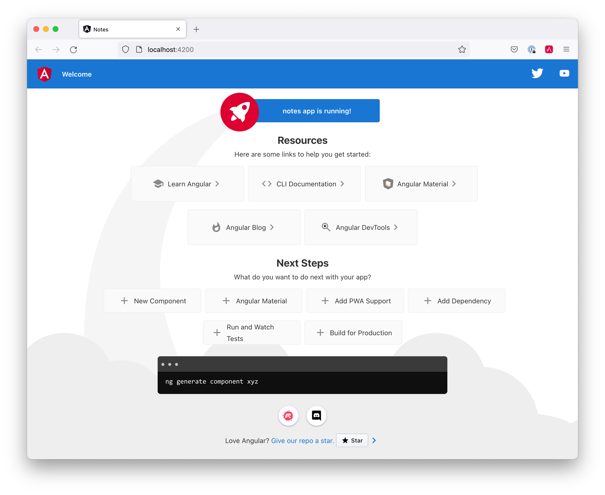
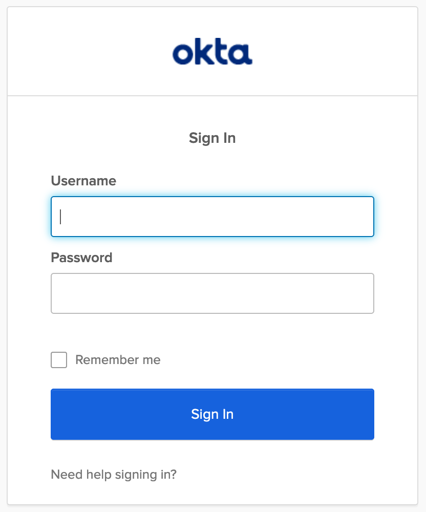
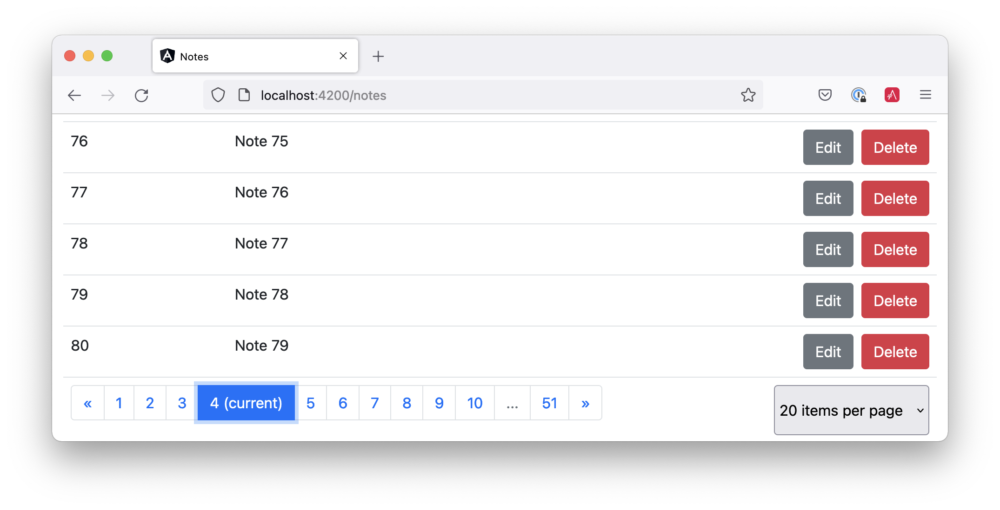

[[chapter-2]]
= Integrate Angular with Spring Boot

////
- Spring Boot 2.4
- Spring Boot with Spring Security
- Spring Boot as an OAuth 2.0 Resource Server
- Spring Data REST
- CORS Integration
- CRUD in Angular
- Security Patterns for Spring Boot
- Add a Data Table with Searching, Sorting, and Pagination
////

Angular is a web framework for building mobile and desktop applications. Its first version, AngularJS, was one of the first JavaScript MVC frameworks to dominate the web landscape. Developers loved it, and it rose to popularity in the early 2010s. AngularJS 1.0 was released on June 14, 2014. Angular 11 was https://blog.angular.io/version-11-of-angular-now-available-74721b7952f7?gi=6131f1d297e3[released on November 12, 2020], giving Angular quite a successful run in the land of web frameworks.

Spring Boot is one of the most popular frameworks for developing Java applications and REST APIs. It also has first-class support for Kotlin!

Spring Boot 1.0 was released on April 1, 2014, and revolutionized the way Java developers write Spring apps. Instead of writing a lot of boilerplate XML or JavaConfig with annotations, Spring Boot introduced the idea of pre-configured _starters_ with smart defaults.

Long story short, they're a match made in heaven!

[[bootiful-angular]]
.Bootiful Angular
image::../images/angular-spring-boot/bootiful-angular.png[Bootiful Angular, 800, scaledwidth="100%"]

== What's New In Angular?

Angular 12 is the version of Angular used in this book. It adds strict typing by default and deprecates Protractor and IE11 support. It also leverages Ivy throughout and deprecates the View Engine, which was Angular’s default renderer before Ivy.

Ivy is a new compiler and renderer, introduced in Angular 9. The renderer is the engine that takes your components and templates and translates them into instructions that manipulate the DOM. Ivy is an internal component, so you don't interact with it directly. However, it can have a significant impact on your code, yielding much smaller JavaScript bundles and increasing performance.

Simply put: upgrading to the latest version of Angular will make your web apps faster!

[TIP]
====
If you have an existing app, you can update to the latest release of Angular using `ng update`:

[source,shell]
----
ng update @angular/cli @angular/core
----
====

== What's New in Spring Boot?

Spring Boot 2.5 was released in May 2021. It adds support for Java 16, Gradle 7, better Docker images, and datasource initialization enhancements.

In this chapter, I'll show you how to build a note-taking application with Angular 12 and Spring Boot 2.5. Along the way, I'll do my best to weave in security tips and how to make your apps more secure.

The Angular and Spring Boot projects release major versions every six months. Since Java does too, this book might be a release or two behind when you're reading this. Both projects have great track records for backward compatibility, so there's a good chance everything will work on newer versions.

Please try newer versions at your own risk and send me an email if you find issues and/or solutions! I've been known to trade t-shirts for contributions. 😉

**Prerequisites:**

* https://nodejs.org/[Node 14]+
* https://adoptopenjdk.net/[Java 11]+

To install Node and Java on a Mac, Linux, or Windows Subsystem for Linux (WSL), you can use https://docs.brew.sh/Installation[Homebrew].

[source,shell]
----
brew install node
brew tap AdoptOpenJDK/openjdk
brew cask install adoptopenjdk11
----

You can also use https://sdkman.io[SDKMAN!] to install Java 11.

[source,shell]
----
sdk install java 11.0.11.hs-adpt
----

// You can refer to the table of contents below for the steps in this tutorial.

== Create an Angular App

To create an Angular app, you first need to install Angular CLI.

[source,shell]
----
npm install -g @angular/cli@12
----

Then create a directory on your hard-drive called `angular-spring-boot`. Open a terminal window and navigate to this directory. Run `ng new` to create an Angular application.

[source,shell]
----
ng new notes --routing --style css
----

This process will take a minute or two to complete, depending on your internet speed and hardware. Once it's finished, navigate into the directory and run `ng serve`.

[source,shell]
----
ng serve
----

Open your browser to `http://localhost:4200`, and you'll see the default homepage.

[[angular-homepage]]
.Angular default homepage

Stop the `ng serve` process using kbd:[Ctrl+C] in your terminal.

== Add Angular Authentication using OpenID Connect

OpenID Connect (also called OIDC) is an identity later based on the OAuth 2.0 specification. It leverages JSON Web Tokens (JWT) to provide an ID token and other features like discoverability and a `/userinfo` endpoint.

Okta has Authentication and User Management APIs that reduce development time with instant-on, scalable user infrastructure. Okta's intuitive API and expert support make it easy for developers to authenticate, manage, and secure users + roles in any application.

To add OIDC login support to your Angular app, you'll first need an https://developer.okta.com/signup[free Okta developer account]. Install the https://cli.okta.com/[Okta CLI] and run `okta register` to sign up for a new account.

If you already have an account, run `okta login`. Then, run `okta apps create`. Select the default app name, or change it as you see fit. Choose **Single-Page App** and press kbd:[Return].

Use `http://localhost:4200/callback` for the Redirect URI and accept the default Logout Redirect URI of `http://localhost:4200`.

.What does the Okta CLI do?
****
The Okta CLI will create an OIDC Single-Page App in your Okta Org. It will add the redirect URIs you specified and grant access to the Everyone group. It will also add a trusted origin for `http://localhost:4200`. You will see output like the following when it's finished:

[source,shell]
----
Okta application configuration:
Issuer:    https://dev-133337.okta.com/oauth2/default
Client ID: 0oab8eb55Kb9jdMIr5d6
----

NOTE: You can also use the Okta Admin Console to create your app. See https://developer.okta.com/docs/guides/sign-into-spa/angular/create-okta-application/[Create an Angular App] for more information.
****

When you create SPA apps with the Okta CLI, PKCE (Proof Key for Code Exchange) is selected by default. This setting provides the maximum level of security you can currently have for single-page apps when using OIDC for auth.

TIP: To learn more about PKCE (pronounced "pixy"), see link:https://developer.okta.com/blog/2019/08/22/okta-authjs-pkce[Implement the OAuth 2.0 Authorization Code with PKCE Flow].

Copy your client ID and your issuer URI (from the Okta CLI's output) into the following command.

[source,shell]
----
ng add @oktadev/schematics --issuer=$issuer --clientId=$clientId
----

This command adds Okta's Angular SDK and configures OIDC authentication for your app.

[[oktadev-schematics]]
.OktaDev Schematics in Action
image::../images/angular-spring-boot/oktadev-schematics.png[OktaDev Schematics in Action, 800, scaledwidth="100%"]

It creates a `home.component.ts` that has authentication logic, as well as a template that renders login and logout buttons.

[source,ts]
.src/app/home/home.component.ts
----
import { Component, OnInit } from '@angular/core';
import { OktaAuthService } from '@okta/okta-angular';

@Component({
  selector: 'app-home',
  templateUrl: './home.component.html',
  styleUrls: ['./home.component.css']
})
export class HomeComponent implements OnInit {
  isAuthenticated: boolean = false;

  constructor(public oktaAuth: OktaAuthService) {
  }

  async ngOnInit() {
    this.isAuthenticated = await this.oktaAuth.isAuthenticated();
    // Subscribe to authentication state changes
    this.oktaAuth.$authenticationState.subscribe(
      (isAuthenticated: boolean)  => this.isAuthenticated = isAuthenticated
    );
  }
}
----

[source,html]
.src/app/home/home.component.html
----

  <button *ngIf="!isAuthenticated" (click)="oktaAuth.signInWithRedirect()">Login</button>
  <button *ngIf="isAuthenticated" (click)="oktaAuth.signOut()">Logout</button>

----

There's also an `HttpInterceptor` created to add an access token to outgoing HTTP requests.

[source,ts]
.src/app/shared/okta/auth.interceptor.ts
----
import { HttpEvent, HttpHandler, HttpInterceptor, HttpRequest } from '@angular/common/http';
import { Observable, from } from 'rxjs';
import { OktaAuthService } from '@okta/okta-angular';
import { Injectable } from '@angular/core';

@Injectable()
export class AuthInterceptor implements HttpInterceptor {

  constructor(private oktaAuth: OktaAuthService) {
  }

  intercept(request: HttpRequest<any>, next: HttpHandler): Observable<HttpEvent<any>> {
    return from(this.handleAccess(request, next));
  }

  private handleAccess(request: HttpRequest<any>, next: HttpHandler): Promise<HttpEvent<any>> {
    // Only add an access token to allowed origins
    const allowedOrigins = ['http://localhost'];
    if (allowedOrigins.some(url => request.urlWithParams.includes(url))) {
      const accessToken = this.oktaAuth.getAccessToken();
      request = request.clone({
        setHeaders: {
          Authorization: 'Bearer ' + accessToken
        }
      });
    }
    return next.handle(request).toPromise();
  }
}
----

NOTE: You might notice that tokens are only added for `http://localhost`. You'll need to modify the `allowedOrigins` array to include your production URL eventually.

Start your app again using `ng serve`, open a private/incognito window to `http://localhost:4200`, and you'll see a **Login** button in the bottom left.

[[angular-login-button]]
.Login button
image::../images/angular-spring-boot/angular-login-button.png[Login button, 800, scaledwidth="100%"]

Click on it, and you'll be redirected to Okta to log in.

[[angular-okta-login]]
.Okta Login form

Enter valid credentials, and you'll be redirected back to your app. There will now be a **Logout** button, indicating that you've authenticated successfully.

[[angular-logout-button]]
.Logout button

Now that you've created a secure Angular app let's create a Spring Boot app to serve up data with a REST API.

== Create a Spring Boot App

The good folks at Pivotal created https://start.spring.io[start.spring.io] to help you create Spring Boot apps quickly with minimal fuss. This site is a Spring Boot app that has a REST API you can talk to with https://httpie.org/[HTTPie].

Kotlin is an intriguing language for Spring developers because it reduces boilerplate code and allows succinct, effective code. Kotlin is 100% interoperable with Java, so you can continue to use the Java libraries and frameworks you know and love. Not only that, but Spring has first-class support for Kotlin.

Create a new Spring Boot app that uses Java 11, Kotlin, Gradle, and has the necessary dependencies to create a secure CRUD API.

[source,shell]
----
http https://start.spring.io/starter.zip javaVersion==11 language==kotlin bootVersion==2.5.2.RELEASE \
artifactId==notes-api groupId==com.okta.developer packageName==com.okta.developer.notes \
type==gradle-project dependencies==h2,data-jpa,data-rest,okta,web -d
----

Run this command in a terminal, and a `notes-api.zip` file will be downloaded. Expand it into the `angular-spring-boot/notes-api` directory.

[source,shell]
----
unzip notes-api.zip -d angular-spring-boot/notes-api
----

You can also use https://start.spring.io/#!type=gradle-project&language=kotlin&platformVersion=2.5.2.RELEASE&packaging=jar&jvmVersion=11&groupId=com.okta.developer&artifactId=demo&name=demo&description=Notes%20API%20for%20Spring%20Boot&packageName=com.okta.developer.notes&dependencies=h2,data-jpa,data-rest,okta,web[start.spring.io] in your browser to create this same app.

[[start.spring.io]]
.Create app with start.spring.io

=== Secure Spring Boot with Spring Security, OAuth 2.0, and OIDC

Because you selected Okta as a dependency, you'll need to create an OIDC app for it to authenticate with Okta. You could use the client ID from your Angular app, but if you ever want to allow people to log in to your Spring Boot app, it'll need its own OIDC app.

Open a terminal and navigate to your Spring Boot app's directory. Run `okta apps create`, specify a name, and select **Web** > **Okta Spring Boot Starter**. Accept the default redirect URIs.

Your app's OIDC settings will be put in `src/main/resources/application.properties`:

[source,properties]
----
okta.oauth2.issuer=https://{yourOktaDomain}/oauth2/default
okta.oauth2.client-id={yourClientId}
okta.oauth2.client-secret={yourClientSecret}
----

However, **you should never store secrets in source control**! To prevent you from checking secrets in, you can use https://github.com/awslabs/git-secrets[git-secrets].

For this example, copy your settings into a new `okta.env` file and ignore `*.env` in your `notes-api/.gitignore` file.

[source,shell]
----
export OKTA_OAUTH2_ISSUER=https://{yourOktaDomain}/oauth2/default
export OKTA_OAUTH2_CLIENT_ID={yourClientId}
export OKTA_OAUTH2_CLIENT_SECRET={yourClientSecret}
----

After replacing the `{...}` placeholders with your values, run `source okta.env` to set these environment variables. Remove the Okta-related properties from your `application.properties` file.

Then start your app using `./gradlew bootRun`. Open `http://localhost:8080` in a browser, and you'll be redirected to Okta to sign in.

TIP: If you don't get prompted, it's because you're already logged in. Try it in an incognito window to see the full login flow.

=== Spring Boot as an OAuth 2.0 Resource Server

Your Spring Boot API is now secure, but it's not configured to look for an `Authorization` header with an access token in it. You need to write some code to make your Spring Boot API an OAuth 2.0 resource server.

Create a `SecurityConfiguration.kt` class in the same directory as `DemoApplication.kt`:

[source,kotlin]
----
package com.okta.developer.notes

import org.springframework.security.config.annotation.web.builders.HttpSecurity
import org.springframework.security.config.annotation.web.configuration.EnableWebSecurity
import org.springframework.security.config.annotation.web.configuration.WebSecurityConfigurerAdapter

@EnableWebSecurity
class SecurityConfiguration : WebSecurityConfigurerAdapter() {
    override fun configure(http: HttpSecurity) {
        //@formatter:off
        http
            .authorizeRequests().anyRequest().authenticated()
                .and()
            .oauth2Login()
                .and()
            .oauth2ResourceServer().jwt()
        //@formatter:on
    }
}
----

NOTE: The `oauth2Login()` configuration is not necessary for this example to work. It's only needed if you want to require authentication from a browser.

== Add a Notes REST API with Spring Data REST

Start by creating a new `Note` entity in `src/main/kotlin/.../notes/DemoApplication.kt`.

[source,kotlin]
----
package com.okta.developer.notes

import com.fasterxml.jackson.annotation.JsonIgnore
import org.springframework.boot.autoconfigure.SpringBootApplication
import org.springframework.boot.runApplication
import javax.persistence.Entity
import javax.persistence.GeneratedValue
import javax.persistence.Id

@SpringBootApplication
class DemoApplication

fun main(args: Array<String>) {
    runApplication<DemoApplication>(*args)
}

@Entity
data class Note(@Id @GeneratedValue var id: Long? = null,
                var title: String? = null,
                var text: String? = null,
                @JsonIgnore var user: String? = null)
----

Kotlin's https://kotlinlang.org/docs/reference/data-classes.html[data classes] are built to hold data. By adding the `data` keyword, your class will get `equals()`, `hashCode()`, `toString()`, and a `copy()` function. The `Type? = null` syntax means the arguments are nullable when creating a new instance of the class.

Create a `NotesRepository` for persisting the data in your notes. Add the following lines of code just below your `Note` entity.

[source,kotlin]
----
@RepositoryRestResource
interface NotesRepository : JpaRepository<Note, Long>
----

The `extends` syntax differs from Java and is a lot more concise (a colon instead of `extends`). If your IDE doesn't automatically add imports, you'll need to add the following at the top of the file.

[source,kotlin]
----
import org.springframework.data.jpa.repository.JpaRepository
import org.springframework.data.rest.core.annotation.RepositoryRestResource
----

To automatically add the username to a note when it's created, add a `RepositoryEventHandler` that is invoked before creating the record.

[source,kotlin]
----
@Component
@RepositoryEventHandler(Note::class)
class AddUserToNote {

    @HandleBeforeCreate
    fun handleCreate(note: Note) {
        val username: String =  SecurityContextHolder.getContext().getAuthentication().name
        println("Creating note: $note with user: $username")
        note.user = username
    }
}
----

The imports for this class are:

[source,kotlin]
----
import org.springframework.data.rest.core.annotation.HandleBeforeCreate
import org.springframework.data.rest.core.annotation.RepositoryEventHandler
import org.springframework.security.core.context.SecurityContextHolder
import org.springframework.stereotype.Component
----

Create a `DataInitializer.kt` class that populates the database with some default data on startup.

[source,kotlin]
----
package com.okta.developer.notes

import org.springframework.boot.ApplicationArguments
import org.springframework.boot.ApplicationRunner
import org.springframework.stereotype.Component

@Component
class DataInitializer(val repository: NotesRepository) : ApplicationRunner {

    @Throws(Exception::class)
    override fun run(args: ApplicationArguments) {
        listOf("Note 1", "Note 2", "Note 3").forEach {
            repository.save(Note(title = it, user = "user"))
        }
        repository.findAll().forEach { println(it) }
    }
}
----

Restart your Spring Boot app, and you should see the following printed to your console on startup.

[source,shell]
----
Note(id=1, title=Note 1, text=null, user=user)
Note(id=2, title=Note 2, text=null, user=user)
Note(id=3, title=Note 3, text=null, user=user)
----

Create a `UserController.kt` class (in the same directory as `DemoApplication.kt`) and use it to filter notes by the currently logged-in user. While you're at it, add a `/user` endpoint that returns the user's information.

[source,kotlin]
----
package com.okta.developer.notes

import org.springframework.security.core.annotation.AuthenticationPrincipal
import org.springframework.security.oauth2.core.oidc.user.OidcUser
import org.springframework.web.bind.annotation.GetMapping
import org.springframework.web.bind.annotation.RestController
import java.security.Principal

@RestController
class UserController(val repository: NotesRepository) {

    @GetMapping("/user/notes")
    fun notes(principal: Principal): List<Note> {
        println("Fetching notes for user: ${principal.name}")
        val notes = repository.findAllByUser(principal.name)
        if (notes.isEmpty()) {
            return listOf()
        } else {
            return notes
        }
    }

    @GetMapping("/user")
    fun user(@AuthenticationPrincipal user: OidcUser): OidcUser {
        return user;
    }
}
----

The `findAllByUser()` method doesn't exist on `NotesRepository`, so you'll need to add it. Thanks to Spring Data JPA, all you need to do is add the method definition to the interface, and it will handle generating the finder method in the implementation.

[source,kotlin]
----
interface NotesRepository : JpaRepository<Note, Long> {
    fun findAllByUser(name: String): List<Note>
}
----

To prevent conflicting paths with the REST endpoints created by `@RepositoryRestResource`, set the base path to `/api` in `application.properties`.

[source,properties]
----
spring.data.rest.base-path=/api
----

Restart your Spring Boot app, navigate to `http://localhost:8080/user`, and you'll see a whole plethora of details about your account. Opening `http://localhost:8080/api/notes` will show the default notes entered by the `DataInitializer` component.

=== Add a CORS Filter for Angular

In order for your Angular app (on port 4200) to communicate with your Spring Boot app (on port 8080), you have to enable CORS (cross-origin resource sharing). You can do this by giving your `DemoApplication` a body and defining a `corsFilter` bean inside it.

[source,kotlin]
----
import org.springframework.boot.web.servlet.FilterRegistrationBean
import org.springframework.context.annotation.Bean
import org.springframework.core.Ordered
import org.springframework.web.cors.CorsConfiguration
import org.springframework.web.cors.UrlBasedCorsConfigurationSource
import org.springframework.web.filter.CorsFilter

@SpringBootApplication
class DemoApplication {

    @Bean
    fun simpleCorsFilter(): FilterRegistrationBean<CorsFilter> {
        val source = UrlBasedCorsConfigurationSource()
        val config = CorsConfiguration()
        config.allowCredentials = true
        config.allowedOrigins = listOf("http://localhost:4200")
        config.allowedMethods = listOf("*");
        config.allowedHeaders = listOf("*")
        source.registerCorsConfiguration("/**", config)
        val bean = FilterRegistrationBean(CorsFilter(source))
        bean.order = Ordered.HIGHEST_PRECEDENCE
        return bean
    }
}
----

Restart your Spring Boot app after adding this bean.

To see how your final `DemoApplication` file should look, you can https://github.com/oktadeveloper/okta-spring-boot-2-angular-9-example/blob/master/notes-api/src/main/kotlin/com/okta/developer/notes/DemoApplication.kt[view the completed version in GitHub].

Now that your API is working, it's time to develop a UI for it with Angular!

== Add a Notes CRUD Feature in Angular

Angular Schematics is a workflow tool that allows you to manipulate any project that has a `package.json`. Angular CLI is based on Schematics. OktaDev Schematics uses Schematics to update and add new files to projects. There's even an https://github.com/manfredsteyer/angular-crud[Angular CRUD] schematic!

Angular CRUD allows you to generate CRUD (create, read, update, and delete) screens and associated files from JSON.

In your Angular `notes` app, install `angular-crud` using npm:

// todo: this release still needs to happen
// see https://github.com/manfredsteyer/angular-crud/pull/29
// in the meantime, clone the repo, run `npm pack`,
// then `npm install /path/to/angular-crud/*.tgz`

[source,shell]
----
npm i -D angular-crud@2
----

Then create a `src/app/note` directory.

[source,shell]
----
mkdir -p src/app/note
----

Then, create a `model.json` file in it that defines metadata that's used when generating files.

[source,json]
----
{
  "title": "Notes",
  "entity": "note",
  "api": {
    "url": "http://localhost:8080/api/notes"
  },
  "filter": [
    "title"
  ],
  "fields": [
    {
      "name": "id",
      "label": "Id",
      "isId": true,
      "readonly": true,
      "type": "number"
    },
    {
      "name": "title",
      "type": "string",
      "label": "Title"
    },
    {
      "name": "text",
      "type": "string",
      "label": "Text"
    }
  ]
}
----

Run the command below to generate CRUD screens.

[source,shell]
----
ng g angular-crud:crud-module note
----

You will see the following output.

[source,shell]
----
CREATE src/app/note/note-filter.ts (44 bytes)
CREATE src/app/note/note.module.ts (659 bytes)
CREATE src/app/note/note.routes.ts (346 bytes)
CREATE src/app/note/note.service.spec.ts (607 bytes)
CREATE src/app/note/note.service.ts (1744 bytes)
CREATE src/app/note/note.ts (69 bytes)
CREATE src/app/note/note-edit/note-edit.component.html (1097 bytes)
CREATE src/app/note/note-edit/note-edit.component.spec.ts (978 bytes)
CREATE src/app/note/note-edit/note-edit.component.ts (1493 bytes)
CREATE src/app/note/note-list/note-list.component.html (1716 bytes)
CREATE src/app/note/note-list/note-list.component.spec.ts (978 bytes)
CREATE src/app/note/note-list/note-list.component.ts (1091 bytes)
UPDATE src/app/app.module.ts (540 bytes)
----

This schematic creates a `NotesModule`, routes, a service to communicate with the API, and list/edit screens for viewing and editing notes. If you look at the `src/app/note/note.routes.ts` file, you'll see the routes it creates.

[source,ts]
----
import { Routes } from '@angular/router';
import { NoteListComponent } from './note-list/note-list.component';
import { NoteEditComponent } from './note-edit/note-edit.component';

export const NOTE_ROUTES: Routes = [
  {
    path: 'notes',
    component: NoteListComponent
  },
  {
    path: 'notes/:id',
    component: NoteEditComponent
  }
];
----

Add a link to the `NoteListComponent` in `src/app/home/home.component.html`.

[source,html]
----

  <button *ngIf="!isAuthenticated" (click)="oktaAuth.signInWithRedirect()">Login</button>
  
<a routerLink="/notes" *ngIf="isAuthenticated">View Notes</a>

  <button *ngIf="isAuthenticated" (click)="oktaAuth.signOut()">Logout</button>

----

Change `src/app/app.component.html` to be as simple as it can be.


[source,html]
----
<h1>{{ title }} app is running!</h1>

<router-outlet></router-outlet>
----


TIP: If you want `npm test` to pass after modifying this template, you'll need to change `app.component.spec.ts` to look for `querySelector('h1')` instead of `querySelector('.content span')`.

Run `ng serve` (and make sure your Spring Boot app is running too).

[[notes-login]]
.Notes App Login
image::../images/angular-spring-boot/notes-login.png[Notes App Login, 800, scaledwidth="100%"]

Log in, and you should see a **View Notes** link.

[[notes-link]]
.Notes Link
image::../images/angular-spring-boot/notes-link.png[Notes Link, 800, scaledwidth="100%"]

Click on the link, and you'll see a list screen like the one below. No notes are displayed because you haven't created any notes that are tied to your user.

[[notes-list]]
.Notes List

Click on the **New** link to add a new note.

[[notes-detail]]
.Notes Detail
image::../images/angular-spring-boot/notes-detail.png[Notes Detail, 800, scaledwidth="100%"]

Add a new note, and you'll see a message like this in your backend console.

[source,shell]
----
Creating note: Note(id=null, title=1st note, text=Wahoo!, user=null) with user: mraible@gmail.com
----

////
This also happens, not sure why:

Failed to evaluate Jackson deserialization for type [[simple type, class org.springframework.data.rest.webmvc.PersistentEntityResource]]: java.lang.NullPointerException

It doesn't seem to cause any issues with data.
////

You still won't see notes in the list. You need to change the `NoteService` to call the `/user/notes` endpoint to get your notes.

[source,ts]
----
find(filter: NoteFilter): Observable<Note[]> {
  const params = {
    title: filter.title,
  };
  const userNotes = 'http://localhost:8080/user/notes';
  return this.http.get<Note[]>(userNotes, {params, headers});
}
----

Now you'll see your notes listed. Nice work!

[[notes-user-list]]
.Notes User List
image::../images/angular-spring-boot/notes-user-list.png[Notes User List, 800, scaledwidth="100%"]

You might be wondering how the `NoteListComponent` works. It loads the user's notes from the `NoteService` when the component initializes, and also contains `select()` and `delete()` methods. The reason it's able to talk to your secured Spring Boot API is that the aforementioned `AuthInterceptor` adds an access token to the request.

[source,ts]
.src/app/note/note-list/note-list.component.ts
----
import { Component, OnInit } from '@angular/core';
import { NoteFilter } from '../note-filter';
import { NoteService } from '../note.service';
import { Note } from '../note';

@Component({
  selector: 'app-note',
  templateUrl: 'note-list.component.html'
})
export class NoteListComponent implements OnInit {

  filter = new NoteFilter();
  selectedNote!: Note;
  feedback: any = {};

  get noteList(): Note[] {
    return this.noteService.noteList;
  }

  constructor(private noteService: NoteService) {
  }

  ngOnInit() {
    this.search();
  }

  search(): void {
    this.noteService.load(this.filter);
  }

  select(selected: Note): void {
    this.selectedNote = selected;
  }

  delete(note: Note): void {
    if (confirm('Are you sure?')) {
      this.noteService.delete(note).subscribe(() => {
          this.feedback = {type: 'success', message: 'Delete was successful!'};
          setTimeout(() => {
            this.search();
          }, 1000);
        },
        err => {
          this.feedback = {type: 'warning', message: 'Error deleting.'};
        }
      );
    }
  }
}
----

The **Edit** link in this component's template links to the `NoteEditComponent`.

[source,html]
----
<a [routerLink]="['../notes', item.id ]" class="btn btn-secondary">Edit</a>
----

The `NoteEditComponent` has methods for loading a note, saving a note, and canceling.

[source,ts]
----
import { Component, OnInit } from '@angular/core';
import { ActivatedRoute, Router } from '@angular/router';
import { NoteService } from '../note.service';
import { Note } from '../note';
import { map, switchMap } from 'rxjs/operators';
import { of } from 'rxjs';

@Component({
  selector: 'app-note-edit',
  templateUrl: './note-edit.component.html'
})
export class NoteEditComponent implements OnInit {

  id!: string;
  note!: Note;
  feedback: any = {};

  constructor(
    private route: ActivatedRoute,
    private router: Router,
    private noteService: NoteService) {
  }

  ngOnInit() {
    this
      .route
      .params
      .pipe(
        map(p => p.id),
        switchMap(id => {
          if (id === 'new') { return of(new Note()); }
          return this.noteService.findById(id);
        })
      )
      .subscribe(note => {
          this.note = note;
          this.feedback = {};
        },
        err => {
          this.feedback = {type: 'warning', message: 'Error loading'};
        }
      );
  }

  save() {
    this.noteService.save(this.note).subscribe(
      note => {
        this.note = note;
        this.feedback = {type: 'success', message: 'Save was successful!'};
        setTimeout(() => {
          this.router.navigate(['/notes']);
        }, 1000);
      },
      err => {
        this.feedback = {type: 'warning', message: 'Error saving'};
      }
    );
  }

  cancel() {
    this.router.navigate(['/notes']);
  }
}
----

=== Fix the Note Edit Feature

One of the problems with the `NoteEditComponent` is it assumes the API returns an ID. Since Spring Data REST uses HATEOS by default, it returns links instead of IDs. You can change this default to return IDs by creating a `RestConfiguration` class in your Spring Boot app. You might notice you can also configure the base path in this class, instead of in `application.properties`.

[source,kotlin]
----
package com.okta.developer.notes

import org.springframework.context.annotation.Configuration
import org.springframework.data.rest.core.config.RepositoryRestConfiguration
import org.springframework.data.rest.webmvc.config.RepositoryRestConfigurer
import org.springframework.web.servlet.config.annotation.CorsRegistry

@Configuration
class RestConfiguration : RepositoryRestConfigurer {

    override fun configureRepositoryRestConfiguration(
        config: RepositoryRestConfiguration?,
        cors: CorsRegistry?
    ) {
        config?.exposeIdsFor(Note::class.java)
        config?.setBasePath("/api")
    }
}
----

Another option is to modify the Angular side of things. Since the ID is passed into the `NoteEditComponent`, you can set it as a local variable, then set it on the note after it's returned. Here's a diff of what changes need to be made in `notes/src/app/note/note-edit/note-edit.component.ts`.

[source,diff]
----
--- a/notes/src/app/note/note-edit/note-edit.component.ts
+++ b/notes/src/app/note/note-edit/note-edit.component.ts
@@ -30,11 +29,13 @@ export class NoteEditComponent implements OnInit {
        map(p => p.id),
        switchMap(id => {
          if (id === 'new') { return of(new Note()); }
+          this.id = id;
          return this.noteService.findById(id);
        })
      )
      .subscribe(note => {
          this.note = note;
+          this.note.id = +note.id;
          this.feedback = {};
        },
        err => {
@@ -47,6 +48,7 @@ export class NoteEditComponent implements OnInit {
    this.noteService.save(this.note).subscribe(
      note => {
        this.note = note;
+        this.note.id = +this.id;
        this.feedback = {type: 'success', message: 'Save was successful!'};
        setTimeout(() => {
          this.router.navigate(['/notes']);
----

In the final example for this chapter, I opted to return IDs from my Spring Boot API.

== Fix Tests by Mocking Spring Security's Configuration

If you open a new terminal window and run `./gradlew test` in the `notes-api` directory, tests will fail. This happens because Spring Security cannot connect to an identity provider on startup. You can run `source okta.env` before running `./gradlew test` to solve the problem. However, this is not a good long-term solution, especially for continuous integration.

To solve this problem, mock the OIDC configuration by creating a `notes-api/src/test/.../notes/MockSecurityConfiguration.kt` class.

[source,kotlin]
.notes-api/src/test/kotlin/com/okta/developer/notes/MockSecurityConfiguration.kt
----
package com.okta.developer.notes

import org.mockito.Mockito.mock
import org.springframework.boot.test.context.TestConfiguration
import org.springframework.context.annotation.Bean
import org.springframework.security.oauth2.client.InMemoryOAuth2AuthorizedClientService
import org.springframework.security.oauth2.client.OAuth2AuthorizedClientService
import org.springframework.security.oauth2.client.registration.ClientRegistration
import org.springframework.security.oauth2.client.registration.ClientRegistrationRepository
import org.springframework.security.oauth2.client.registration.InMemoryClientRegistrationRepository
import org.springframework.security.oauth2.client.web.AuthenticatedPrincipalOAuth2AuthorizedClientRepository
import org.springframework.security.oauth2.client.web.OAuth2AuthorizedClientRepository
import org.springframework.security.oauth2.core.AuthorizationGrantType
import org.springframework.security.oauth2.core.ClientAuthenticationMethod
import org.springframework.security.oauth2.jwt.JwtDecoder

@TestConfiguration
class MockSecurityConfiguration {
    private val clientRegistration: ClientRegistration

    @Bean
    fun clientRegistrationRepository(): ClientRegistrationRepository {
        return InMemoryClientRegistrationRepository(clientRegistration)
    }

    private fun clientRegistration(): ClientRegistration.Builder {
        val metadata: MutableMap<String, Any> = HashMap()
        metadata["end_session_endpoint"] = "https://angular.org/logout"
        return ClientRegistration.withRegistrationId("okta")
            .redirectUri("{baseUrl}/{action}/oauth2/code/{registrationId}")
            .clientAuthenticationMethod(ClientAuthenticationMethod.CLIENT_SECRET_BASIC)
            .authorizationGrantType(AuthorizationGrantType.AUTHORIZATION_CODE)
            .scope("read:user")
            .authorizationUri("https://angular.org/login/oauth/authorize")
            .tokenUri("https://angular.org/login/oauth/access_token")
            .jwkSetUri("https://angular.org/oauth/jwk")
            .userInfoUri("https://api.angular.org/user")
            .providerConfigurationMetadata(metadata)
            .userNameAttributeName("id")
            .clientName("Client Name")
            .clientId("client-id")
            .clientSecret("client-secret")
    }

    @Bean
    fun jwtDecoder(): JwtDecoder {
        return mock(JwtDecoder::class.java)
    }

    @Bean
    fun authorizedClientService(clientRegistrationRepository: ClientRegistrationRepository?): OAuth2AuthorizedClientService {
        return InMemoryOAuth2AuthorizedClientService(clientRegistrationRepository)
    }

    @Bean
    fun authorizedClientRepository(authorizedClientService: OAuth2AuthorizedClientService?): OAuth2AuthorizedClientRepository {
        return AuthenticatedPrincipalOAuth2AuthorizedClientRepository(authorizedClientService)
    }

    init {
        clientRegistration = clientRegistration().build()
    }
}
----

Then, modify `DemoApplicationTests.kt` to use this class.

[source,kotlin]
.notes-api/src/test/kotlin/com/okta/developer/notes/DemoApplicationTests.kt
----
package com.okta.developer.notes

import org.junit.jupiter.api.Test
import org.springframework.boot.test.context.SpringBootTest

@SpringBootTest(classes = [DemoApplication::class, MockSecurityConfiguration::class])
class DemoApplicationTests {

	@Test
	fun contextLoads() {}

}
----

Now, running `./gradlew test` should pass as expected.

== Lock Down Spring Boot with Recommended Security Practices

In link:/blog/2018/07/30/10-ways-to-secure-spring-boot[10 Excellent Ways to Secure Your Spring Boot Application], I recommended a few Spring Boot-specific items:

1. Use HTTPS in Production
2. Enable Cross-Site Request Forgery (CSRF) Protection
3. Use a Content Security Policy (CSP) to Prevent XSS Attacks
4. Use OpenID Connect for Authentication

You've already implemented #4 with Okta, but what about the others?

You can use https://github.com/FiloSottile/mkcert[mkcert] to generate local, valid TLS certificates. To force HTTPS, you just need to configure Spring Security. I like just to do it in production, so I don't need to install certificates in development.

CSRF protection and a CSP can be configured with Spring Security.

Modify your `SecurityConfiguration` class with these security enhancements.

====
[source,kotlin]
----
class SecurityConfiguration : WebSecurityConfigurerAdapter() {
    override fun configure(http: HttpSecurity) {
        //@formatter:off
        http
            .authorizeRequests().anyRequest().authenticated()
                .and()
            .oauth2Login()
                .and()
            .oauth2ResourceServer().jwt()

        http.requiresChannel()
            .requestMatchers(RequestMatcher {
                r -> r.getHeader("X-Forwarded-Proto") != null
            }).requiresSecure() // <.>

        http.csrf()
            .csrfTokenRepository(CookieCsrfTokenRepository.withHttpOnlyFalse()); // <.>

        http.headers()
            .contentSecurityPolicy("script-src 'self'; report-to /csp-report-endpoint/"); // <.>
       //@formatter:on
    }
}
----
<.> Force HTTPS in production
<.> Configure the CSRF Cookie so it can be read by JavaScript
<.> Configure a CSP that only allows local scripts
====

Angular's `HttpClient` has built-in support for the client-side half of the CSRF protection. It'll read the cookie sent by Spring Boot and return it in an `X-XSRF-TOKEN` header. You can read more about this in https://angular.io/guide/security[Angular's Security docs].

In this particular example, the CSP won't be used since Angular is a separate app. However, if you were to include the Angular app in your Spring Boot artifact, it'd come in handy.

TIP: Once you've deployed your Spring Boot app to a public URL, you can test your CSP headers are working with https://securityheaders.com/[securityheaders.com].

// == Learn More About Angular, Spring Boot, and Kotlin
== Summary

In this chapter, I showed you how to create an Angular app, a Spring Boot app, and how to secure communication between them with OAuth 2.0 and OIDC. You used Kotlin on the backend; a language loved by many. You used Angular Schematics to generate code for authentication and CRUD, improving your efficiency as a developer.

This section did not show you how to make your Angular app look good, add validation, or how to deploy it to a public server. I'll tackle those topics in the next section.

// todo: Figure out how to share source code - maybe as a .zip on InfoQ until this repo is public?
// proposal: Download the `source.zip` for this book from InfoQ. The `angular-spring-boot` directory has this chapter's completed example.

// You can find the source code for this chapter at https://github.com/oktadev/okta-spring-boot-2-angular-12-example[oktadev/okta-spring-boot-2-angular-12-example].

== Build Beautiful Angular Apps with Bootstrap

I've been a longtime fan of CSS frameworks since 2005. I led an open-source project called AppFuse at the time and wanted a way to provide themes for our users. We used Mike Stenhouse's CSS Framework and held a design content to gather some themes we liked for our users. A couple of other CSS frameworks came along in the next few years, namely Blueprint in 2007 and Compass in 2008.

However, no CSS frameworks took the world by storm like Bootstrap. Back then, it was called Twitter Bootstrap. Mark Otto and Jacob Thornton invented it in mid-2010 while they worked at Twitter. As they wrote in "Building Twitter Bootstrap" in Issue 324 of A List Apart:

> Our goal is to provide a refined, well-documented, and extensive library of flexible design components built with HTML, CSS, and JavaScript for others to build and innovate on.

They released Bootstrap on August 19, 2011, and it quickly became _the_ most popular project on GitHub. Developers like myself all over the world started using it.

Another web framework took the world by storm the following year: AngularJS. AngularJS (v0.9) first appeared on GitHub in October 2010. The creators released version 1.0 on June 14, 2012.

Together, these frameworks have had quite a run. It's hard to believe that they've lasted so long, especially considering both projects have had major rewrites!

== Isn't Angular Dead?

I've heard many developers say that Angular is dead. As a veteran Java developer, I've heard this said about Java many times over the years as well. Yet it continues to thrive. Angular is similar in that it's become somewhat boring. Some people call boring frameworks "legacy." Others call them "revenue-generating."

Whatever you want to call it, Angular is far from dead.

== Angular Still Loves Bootstrap

You might think that Angular Material is more popular than Bootstrap these days. You might be right, but I believe that who you follow on Twitter shapes your popularity perspective. Most of the fabulous folks that follow me still use Bootstrap.

++++

<blockquote class="twitter-tweet">
If you&#39;re developing <a href="https://twitter.com/angular?ref_src=twsrc%5Etfw">@angular</a> apps, what&#39;s your preferred CSS framework? <a href="https://twitter.com/hashtag/Angular?src=hash&amp;ref_src=twsrc%5Etfw">#Angular</a> <a href="https://twitter.com/hashtag/CSS?src=hash&amp;ref_src=twsrc%5Etfw">#CSS</a>
&mdash; Matt Raible (@mraible) <a href="https://twitter.com/mraible/status/1196894737870938113?ref_src=twsrc%5Etfw">November 19, 2019</a></blockquote> 

++++

== Integrate Bootstrap with Angular

Today I'd like to show you how to integrate Bootstrap into an Angular application. I'll start with the note-taking example from the last section. I'll show you how to integrate Bootstrap, convert the app to use Sass (because CSS is more fun with Sass), make the app look good, add form validation, and write some code to develop a searchable, sortable, and pageable data table. The last part sounds hard, but it only requires < 10 lines of code on the Spring Boot side of things. Kotlin and Spring Data JPA FTW!

If you're following along, you should have an `angular-spring-boot` directory with an Angular and a Spring Boot app in it.

If you'd rather start from this point, download the `source.zip` for this book from InfoQ. The `angular-spring-boot` directory has the previous sections's completed example. Copy it to `angular-bootstrap` in your favorite code location.

In a terminal, navigate into this new directory and its `notes` folder. Then install the dependencies for the Angular app.

[source,shell]
----
cd angular-bootstrap/notes
npm i
----

Add Bootstrap and NG Bootstrap:

[source,shell]
----
npm i bootstrap @ng-bootstrap/ng-bootstrap --force
----
// todo: add versions and remove force once ng-bootstrap supports Angular 12.
// https://github.com/ng-bootstrap/ng-bootstrap/issues/4093

TIP: You can leave off the version numbers if you like. However, this tutorial is only guaranteed to work with the versions specified.

Import `NgbModule` in `app.module.ts`:

[source,ts]
.src/app/app.module.ts
----
import { NgbModule } from '@ng-bootstrap/ng-bootstrap';

@NgModule({
  ...
  imports: [
    ...
    NgbModule
  ],
  ...
})
export class AppModule { }
----

If you run `ng serve -o`, you'll get a blank screen. Look in your browser's developer console, and you'll see why.

[source,shell]
----
Uncaught Error: It looks like your application or one of its dependencies is using i18n.
Angular 9 introduced a global `$localize()` function that needs to be loaded.
Please run `ng add @angular/localize` from the Angular CLI.
----

Cancel the process and run `ng add @angular/localize` to fix this error. Now, if you restart your app, you'll see it's pretty simple. And kinda ugly.

[[notes-bare-bones]]
.Bare-bones styling

Let's fix that!

Modify `styles.css` to add a reference to Bootstrap's CSS file:

[source,css]
.src/styles.css
----
@import "~bootstrap/dist/css/bootstrap.css";
----

And change `app.component.html` to use Bootstrap classes.


[source,html]
.src/app/app.component.html
----
<nav class="navbar navbar-expand-lg navbar-dark bg-dark">
  <a class="navbar-brand text-light" href="#">{{ title }} app is running!</a>
</nav>

  <router-outlet></router-outlet>

----


Now we're getting somewhere!

[[notes-slightly-styled]]
.Slightly styled
image::../images/angular-bootstrap/notes-slightly-styled.png[Slightly styled, 800, scaledwidth="100%"]

To make the login button work, you need to configure both apps' security configurations. Thankfully, that's easy with the Okta CLI!

[source,shell]
----
# in the notes directory
okta apps create # select SPA > http://localhost:4200/callback

# in the notes-api directory
okta apps create # select Web > Spring Boot Starter > defaults
----

Restart both apps:

[source,shell]
----
# in the notes directory
npm start

# in the notes-api directory
./gradlew bootRun
----

Now you should be able to log in with your Okta credentials and create notes to your heart's content!

[[first-note]]
.First note

You'll notice there's some styling, but things aren't quite _beautiful_. Yet...

////
Commit your progress to Git from the `angular-bootstrap` directory.

[source,shell]
----
git commit -am "Add Bootstrap and configure OIDC"
----
////

== Use Sass to Customize Bootstrap

Before you make things awesome, I'd like to show you how to convert from using CSS with Angular to using Sass. Why? Because https://sass-lang.com/[Sass] is completely compatible with CSS, and it makes CSS more like programming. It also allows you to customize Bootstrap by overriding its variables.

NOTE: If you're not into Sass, you can <<#make-angular-beautiful,skip this section>>. Everything will still work without it.

If you run the following `find` command:

[source,shell]
----
find . -name "*.css" -not -path "./node_modules/*"
----

You'll see three files have a `.css` extension.

[source,shell]
----
./src/app/home/home.component.css
./src/app/app.component.css
./src/styles.css
----

You can manually rename these to have a `.scss` extension, or do it programmatically.

[source,shell]
----
find . -name "*.css" -not -path "./node_modules/*" | rename -v "s/css/scss/g"
----

NOTE: I had to `brew install rename` on my Mac for this command to work.

Then, replace all references to `.css` files.

[source,shell]
----
find ./src/app -type f -exec sed -i '' -e  's/.css/.scss/g' {} \;
----

Modify `angular.json` to reference `src/styles.scss` (in the `build` and `test` sections).

[source,json]
----
"styles": [
  "src/styles.scss"
],
----

And change `styles.scss` to import Bootstrap's Sass.

[source,css]
.src/styles.scss
----
@import "~bootstrap/scss/bootstrap.scss";
----

To demonstrate how you can override Bootstrap's variables, create a `src/_variables.scss` and override the colors. You can see the https://github.com/twbs/bootstrap/blob/v4-dev/scss/_variables.scss[default variables in Bootstrap's GitHub repo].

[source,sass]
----
$primary: orange;
$secondary: blue;
$light: lighten($primary, 20%);
$dark: darken($secondary, 10%);
----

Then import this file at the top of `src/styles.scss`:

[source,sass]
----
@import "variables";
@import "~bootstrap/scss/bootstrap.scss";
----

You'll see the colors change after these updates.

[[bootstrap-sass]]
.Customized Bootstrap variables

Comment out (or remove) the variables in `_variables.scss` to revert to Bootstrap's default colors.

anchor:make-angular-beautiful[]

== Make Your Angular App Beautiful with Bootstrap

You can see from the screenshots above that `angular-crud` generates screens with some styling, but it's not quite right. Let's start by adding a https://getbootstrap.com/docs/4.4/components/navbar/[Navbar] in `app.component.html`. Change its HTML to have a collapsible navbar (for mobile devices), add links to useful sites, and add login/logout buttons. While you're at it, display a message to the user when they aren't authenticated.

[source,html]
.src/app/app.component.html
----
<nav class="navbar navbar-expand-lg navbar-dark bg-dark">
  <a class="navbar-brand" href="#">
    
    {{ title }}
  </a>
  <button class="navbar-toggler" type="button" data-toggle="collapse" data-target="#navbarSupportedContent" aria-controls="navbarSupportedContent" aria-expanded="false" aria-label="Toggle navigation">
    
  </button>

  

    <ul class="navbar-nav ml-auto">
      <li class="nav-item">
        <a class="nav-link" href="#">Home</a>
      </li>
      <li class="nav-item">
        <a class="nav-link" href="https://twitter.com/mraible">@mraible</a>
      </li>
      <li class="nav-item">
        <a class="nav-link" href="https://github.com/mraible">GitHub</a>
      </li>
      <li class="nav-item pl-lg-3">
        <button *ngIf="!isAuthenticated" (click)="oktaAuth.signInWithRedirect()" class="btn btn-outline-primary">Login</button>
        <button *ngIf="isAuthenticated" (click)="oktaAuth.signOut()" class="btn btn-outline-secondary">Logout</button>
      </li>
    </ul>
  

</nav>

  <a *ngIf="!isAuthenticated">Please log in to manage your notes.</a>
  <router-outlet></router-outlet>

----

Remove the login and logout buttons from `home.component.html`.

[source,html]
.src/app/home/home.component.html
----

<a routerLink="/notes" *ngIf="isAuthenticated">View Notes</a>

----

Run `ng serve` and you'll be able to see your stylish app at `http://localhost:4200`.

[[notes-with-navbar]]
.Notes app with navbar

=== Fix Bootstrap's Responsive Menu

If you reduce the width of your browser window, you'll see the menu collapses to take up less real estate.

[[navbar-squished]]
.Navbar squished

However, if you click on it, the menu doesn't expand. To fix that, you need to use the `ngbCollapse` directive from NG Bootstrap. Modify `app.component.html` to have a click handler on the navbar toggle and add `ngbCollapse` to the menu.

[source,html]
.src/app/app/app.component.html
----
<button (click)="isCollapsed = !isCollapsed" class="navbar-toggler" ...>
  ...
</button>

  ...

----

Then add `isCollapsed` in `app.component.ts` and change the `title` to be capitalized.

[source,ts]
.src/app/app/app.component.ts
----
export class AppComponent implements OnInit {
  title = 'Notes';
  isAuthenticated: boolean = false;
  isCollapsed = true;

  ...

}
----

Now, you'll be able to toggle the menu!

[[notes-menu]]
.Squished navbar with menu

=== Update the Note List Angular Template

// todo: Reword for Angular CRUD 2.0 release

Modify the `note-list.component.html` so the breadcrumb doesn't float right and all the content is in the same card.


[source,html]
.src/app/note/note-list/note-list.component.html
----
<ol class="breadcrumb">
  <li class="breadcrumb-item"><a routerLink="/">Home</a></li>
  <li class="breadcrumb-item active">Notes</li>
</ol>

  

    <h2 class="card-title">Notes List</h2>
    

      <form #f="ngForm" class="form-inline">
        

          <label for="title">Title:</label>
          <input [(ngModel)]="filter.title" id="title" name="title" class="form-control ml-2 mr-2">
        

        <button (click)="search()" [disabled]="!f?.valid" class="btn btn-primary">Search</button>
        <a [routerLink]="['../notes', 'new' ]" class="btn btn-default">New</a>
      </form>
    

    
 0">
      
{{ feedback.message }}

      

        <table class="table table-centered table-hover mb-0" id="datatable">
          <thead>
          <tr>
            <th class="border-top-0" scope="col">Id</th>
            <th class="border-top-0" scope="col">Title</th>
            <th class="border-top-0" scope="col">Text</th>
            <th class="border-top-0" scope="col" style="width:120px"></th>
          </tr>
          </thead>
          <tbody>
          <tr *ngFor="let item of noteList" [class.active]="item === selectedNote">
            <td>{{item.id}}</td>
            <td>{{item.title}}</td>
            <td>{{item.text}}</td>
            <td style="white-space: nowrap">
              <a [routerLink]="['../notes', item.id ]" class="btn btn-secondary">Edit</a>&nbsp;
              <button (click)="delete(item)" class="btn btn-danger">Delete</button>
            </td>
          </tr>
          </tbody>
        </table>
      

    

----


That looks better!

[[styled-notes-list]]
.Styled Notes List

=== Add Validation and Bootstrap to the Note Edit Template

If you click the **New** button, you'll see the form needs some work too. Bootstrap has excellent support for https://getbootstrap.com/docs/4.4/components/forms/[stylish forms] using its `form-group` and `form-control` classes. `note-edit.component.html` already uses these classes; you just need to rearrange some things to use the proper `card-*` classes.

// todo: Reword for Angular CRUD 2.0 release

[source,html]
.src/app/note/note-edit/note-edit.component.html
----
<ol class="breadcrumb">
  <li class="breadcrumb-item"><a routerLink="/">Home</a></li>
  <li class="breadcrumb-item active">Notes</li>
</ol>

  

    <h2 class="card-title">Notes Detail</h2>
    

      
{{ feedback.message }}

      <form *ngIf="note" #editForm="ngForm" (ngSubmit)="save()">
        

          <label>Id</label>
          {{note.id || 'n/a'}}
        

        

          <label for="title">Title</label>
          <input [(ngModel)]="note.title" id="title" name="title" class="form-control">
        

        

          <label for="text">Text</label>
          <input [(ngModel)]="note.text" id="text" name="text" class="form-control">
        

        <button type="submit" class="btn btn-primary" [disabled]="!editForm.form.valid">Save</button>
        <button type="button" class="btn btn-secondary ml-2" (click)="cancel()">Cancel</button>
      </form>
    

  

----

That's an improvement!

[[styled-notes-form]]
.Styled Notes Form

To make the `title` field required, add a `required` attribute to its `<input>` tag, along with a name so it can be referenced in an error message.

[source,html]
----

  <label for="title">Title</label>
  <input [(ngModel)]="note.title" id="title" name="title" class="form-control" required
         #name="ngModel" [ngClass]="{'is-invalid': name.touched && name.invalid,  'is-valid': name.touched && name.valid}">
  

    Title is required
  

----

Now when you add a new note, it'll let you know that it requires a title.

[[notes-edit-required-title]]
.Title is required

If you give it focus and leave, it'll add a red border around the field.

[[notes-edit-red-outline]]
.Dirty title validation decoration

== Add a Searchable, Sortable, and Pageable Data Table with Angular and Spring Data JPA

At the beginning of this section, I said I'd show you how to develop a searchable, sortable, and pageable data table. NG Bootstrap has a https://ng-bootstrap.github.io/#/components/table/examples#complete[complete example] I used to build the section below. The major difference is you'll be using a real server, not a simulated one. Spring Data JPA has some slick features that make this possible, namely its query methods and paging/sorting.

=== Add Search by Title with Spring Data JPA

Adding search functionality requires the fewest code modifications. Change the `UserController#notes()` method in your Spring Boot app to accept a title parameter and return notes with the parameter's value in their title.

[source,kotlin]
.notes-api/src/main/kotlin/com/okta/developer/notes/UserController.kt
----
@GetMapping("/user/notes")
fun notes(principal: Principal, title: String?): List<Note> {
    println("Fetching notes for user: ${principal.name}")
    return if (title.isNullOrEmpty()) {
        repository.findAllByUser(principal.name)
    } else {
        println("Searching for title: ${title}")
        repository.findAllByUserAndTitleContainingIgnoringCase(principal.name, title)
    }
}
----

Add the new repository method to the `NotesRepository` in `DemoApplication.kt`.

[source,kotlin]
.notes-api/src/main/kotlin/com/okta/developer/notes/DemoController.kt
----
@RepositoryRestResource
interface NotesRepository : JpaRepository<Note, Long> {
    fun findAllByUser(name: String): List<Note>
    fun findAllByUserAndTitleContainingIgnoreCase(name: String, term: String): List<Note>
}
----

Restart your server and add a few notes, and you should be able to search for them by title in your Angular app. I love how Spring Data JPA makes this so easy!

=== Add Sort Functionality with Angular and Bootstrap

To begin, create a `sortable.directive.ts`.

[source,ts]
.src/app/note/note-list/sortable.directive.ts
----
import { Directive, EventEmitter, Input, Output } from '@angular/core';

export type SortDirection = 'asc' | 'desc' | '';
const rotate: { [key: string]: SortDirection } = {asc: 'desc', desc: '', '': 'asc'};

export interface SortEvent {
  column: string;
  direction: SortDirection;
}

@Directive({
  selector: 'th[sortable]',
  host: {
    '[class.asc]': 'direction === "asc"',
    '[class.desc]': 'direction === "desc"',
    '(click)': 'rotate()'
  }
})
export class SortableHeaderDirective {

  @Input() sortable!: string;
  @Input() direction: SortDirection = '';
  @Output() sort = new EventEmitter<SortEvent>();

  rotate() {
    this.direction = rotate[this.direction];
    this.sort.emit({column: this.sortable, direction: this.direction});
  }
}
----

Add it as a declaration in `note.module.ts`.

[source,ts]
.src/app/note/node.module.ts
----
import { SortableHeaderDirective } from './note-list/sortable.directive';

@NgModule({
  ...
  declarations: [
    ...
    SortableHeaderDirective
  ],
  ...
}
----

Add a `headers` variable to `note-list.component.ts` and an `onSort()` method.

[source,ts]
.src/app/note/node.module.ts
----
import { Component, OnInit, QueryList, ViewChildren } from '@angular/core';
import { SortableHeaderDirective, SortEvent} from './sortable.directive';

export class NoteListComponent implements OnInit {
  @ViewChildren(SortableHeaderDirective) headers!: QueryList<SortableHeaderDirective>;

  ...

  onSort({column, direction}: SortEvent) {
    // reset other headers
    this.headers.forEach(header => {
      if (header.sortable !== column) {
        header.direction = '';
      }
    });

    this.filter.column = column;
    this.filter.direction = direction;
    this.search();
  }

  ...
}
----

Update the `note-filter.ts` to have `column` and `direction` properties.

[source,ts]
.src/app/note/note-filter.ts
----
export class NoteFilter {
  title = '';
  column!: string;
  direction!: string;
}
----

Modify the `find()` method in `NoteService` to pass a `sort` parameter when appropriate.

[source,ts]
.src/app/note/note.service.ts
----
import { map } from 'rxjs/operators';

...

find(filter: NoteFilter): Observable<Note[]> {
  const params: any = {
    title: filter.title,
    sort: `${filter.column},${filter.direction}`,
  };
  if (!filter.direction) { delete params.sort; }

  const userNotes = 'http://localhost:8080/user/notes';
  return this.http.get(userNotes, {params, headers}).pipe(
    map((response: any) => {
      return response.content;
    })
  );
}
----

Update `note-list.component.html` so it uses the `sortable` directive and calls `onSort()` when a user clicks it.

[source,html]
.src/app/note/note-list/note-list.component.html
----
<thead>
  <tr>
    <th class="border-top-0" scope="col">#</th>
    <th class="border-top-0" scope="col" sortable="title" (sort)="onSort($event)">Title</th>
    <th class="border-top-0" scope="col" sortable="text" (sort)="onSort($event)">Text</th>
    <th class="border-top-0" scope="col" style="width:120px"></th>
  </tr>
</thead>
----

Add CSS in `styles.scss` to show a sort indicator when a user sorts a column.

[source,css]
.src/styles.scss
----
th[sortable] {
  cursor: pointer;
  user-select: none;
  -webkit-user-select: none;
}

th[sortable].desc:before, th[sortable].asc:before {
  content: '';
  display: block;
  background: url('data:image/png;base64,iVBORw0KGgoAAAANSUhEUgAAAEAAAABACAYAAACqaXHeAAAAAXNSR0IArs4c6QAAAmxJREFUeAHtmksrRVEUx72fH8CIGQNJkpGUUmakDEiZSJRIZsRQmCkTJRmZmJgQE0kpX0D5DJKJgff7v+ru2u3O3vvc67TOvsdatdrnnP1Y///v7HvvubdbUiIhBISAEBACQkAICAEhIAQ4CXSh2DnyDfmCPEG2Iv9F9MPlM/LHyAecdyMzHYNwR3fdNK/OH9HXl1UCozD24TCvILxizEDWIEzA0FcM8woCgRrJCoS5PIwrANQSMAJX1LEI9bqpQo4JYNFFKRSvIgsxHDVnqZgIkPnNBM0rIGtYk9YOOsqgbgepRCfdbmFtqhFkVEDVPjJp0+Z6e6hRHhqBKgg6ZDCvYBygVmUoEGoh5JTRvIJwhJo1aUOoh4CLPMyvxxi7EWOMgnCGsXXI1GIXlZUYX7ucU+kbR8NW8lh3O7cue0Pk32MKndfUxQFAwxdirk3fHappAnc0oqDPzDfGTBrCfHP04dM4oTV8cxr0SVzH9FF07xD3ib6xCDE+M+aUcVygtWzzbtGX2rPBrEUYfecfQkaFzYi6HjVnGBdtL7epqAlc1+jRdAap74RrnPc4BCijttY2tRcdN0g17w7HqZrXhdJTYAuS3hd8z+vKgK3V1zWPae0mZDMykadBn1hTQBLnZNwVrJpSe/NwEeDsEwCctEOsJTsgxLvCqUl2ACftEGvJDgjxrnBqkh3ASTvEWrIDQrwrnJpkB3DSDrGW7IAQ7wqnJtkBnLRztejXXVu4+mxz/nQ9jR1w5VB86ejLTFcnnDwhzV+F6T+CHZlx6THSjn76eyyBIOPHyDakhBAQAkJACAgBISAEhIAQYCLwC8JxpAmsEGt6AAAAAElFTkSuQmCC') no-repeat;
  background-size: 22px;
  width: 22px;
  height: 22px;
  float: left;
  margin-left: -22px;
}

th[sortable].desc:before {
  transform: rotate(180deg);
  -ms-transform: rotate(180deg);
}
----

=== Add Sorting and Paging in Spring Boot with Spring Data JPA

On the server, you can use https://docs.spring.io/spring-data/rest/docs/current/reference/html/#paging-and-sorting[Spring Data's support for paging and sorting]. Add a `Pageable` argument to `UserController#notes()` and return a `Page` instead of a `List`.

[source,kotlin]
.notes-api/src/main/kotlin/com/okta/developer/notes/UserController.kt
----
package com.okta.developer.notes

import org.springframework.data.domain.Page
import org.springframework.data.domain.Pageable
import org.springframework.security.core.annotation.AuthenticationPrincipal
import org.springframework.security.oauth2.core.oidc.user.OidcUser
import org.springframework.web.bind.annotation.GetMapping
import org.springframework.web.bind.annotation.RestController
import java.security.Principal

@RestController
class UserController(val repository: NotesRepository) {

    @GetMapping("/user/notes")
    fun notes(principal: Principal, title: String?, pageable: Pageable): Page<Note> {
        println("Fetching notes for user: ${principal.name}")
        return if (title.isNullOrEmpty()) {
            repository.findAllByUser(principal.name, pageable)
        } else {
            println("Searching for title: ${title}")
            repository.findAllByUserAndTitleContainingIgnoreCase(principal.name, title, pageable)
        }
    }

    @GetMapping("/user")
    fun user(@AuthenticationPrincipal user: OidcUser): OidcUser {
        return user;
    }
}
----

Modify `NotesRepository` to add a `Pageable` argument to its methods and return a `Page`.

[source,kotlin]
.notes-api/src/main/kotlin/com/okta/developer/notes/DemoApplication.kt
----
import org.springframework.data.domain.Page
import org.springframework.data.domain.Pageable

...

@RepositoryRestResource
interface NotesRepository : JpaRepository<Note, Long> {
    fun findAllByUser(name: String, pageable: Pageable): Page<Note>
    fun findAllByUserAndTitleContainingIgnoreCase(name: String, term: String, pageable: Pageable): Page<Note>
}
----

While you're updating the Spring Boot side of things, modify `DataInitializer` to create a thousand notes for your user. Make sure to replace `<your username>` with the email address you use to log in to Okta.

[source,kotlin]
----
@Component
class DataInitializer(val repository: NotesRepository) : ApplicationRunner {

    @Throws(Exception::class)
    override fun run(args: ApplicationArguments) {
        for (x in 0..1000) {
            repository.save(Note(title = "Note ${x}", user = "<your username>"))
        }
        repository.findAll().forEach { println(it) }
    }
}
----

Restart your Spring Boot app to make the data available for searching. Click on the **Title** column to see sorting in action!

[[notes-list-with-sorting]]
.Notes list with sorting

=== Add Pagination with Angular and Bootstrap

The last feature to add is pagination with NG Bootstrap's `<ngb-pagination>` component. Begin by adding `page` and `size` variables (with default values) to `note-filter.ts`.

[source,ts]
.src/app/note/note-filter.ts
----
export class NoteFilter {
  title = '';
  column: string;
  direction: string;
  page = 0;
  size = 20;
}
----

At the bottom of `note-list.component.html` (just after `</table>`), add the pagination component, along with a page-size selector.

[source,html]
.src/app/note/note-list/note-list.component.html
----

  <ngb-pagination [maxSize]="10"
    [collectionSize]="total$ | async" [(page)]="filter.page" [pageSize]="filter.size" (pageChange)="onPageChange(filter.page)">
  </ngb-pagination>

  <select class="custom-select" style="width: auto" name="pageSize" [(ngModel)]="filter.size" (ngModelChange)="onChange(filter.size)">
    <option [ngValue]="10">10 items per page</option>
    <option [ngValue]="20">20 items per page</option>
    <option [ngValue]="100">100 items per page</option>
  </select>

----

Add `NgbModule` as an import to `note.module.ts`.

[source,ts]
.src/app/note/note.module.ts
----
import { NgbModule } from '@ng-bootstrap/ng-bootstrap';

@NgModule({
  imports: [
    ...
    NgbModule
  ],
  ...
}
----

In `note-list.component.ts`, add a `total$` observable and set it from the `search()` method. Then add an `onPageChange()` method and an `onChange()` method, and modify `onSort()` to set the page to 0.

// note: I had to change from Observable<number> to Observable<any> to get it to compile. Seems strange.

[source,ts]
.src/app/note/note-list/note-list.component.ts
----
import { Observable } from 'rxjs';

export class NoteListComponent implements OnInit {
  total$!: Observable<any>;

  ...

  search(): void {
    this.noteService.load(this.filter);
    this.total$ = this.noteService.size$;
  }

  onChange(pageSize: number) {
    this.filter.size = pageSize;
    this.filter.page = 0;
    this.search();
  }

  onPageChange(page: number) {
    this.filter.page = page - 1;
    this.search();
    this.filter.page = page;
  }

  onSort({column, direction}: SortEvent) {
    // reset other headers
    this.headers.forEach(header => {
      if (header.sortable !== column) {
        header.direction = '';
      }
    });

    this.filter.column = column;
    this.filter.direction = direction;
    this.filter.page = 0;
    this.search();
  }
}
----

Then update `notes.service.ts` to add a `size$` observable and parameters for the page size and page number.

[source,ts]
.src/app/note/note.service.ts
----
import { BehaviorSubject, Observable } from 'rxjs';

...

export class NoteService {
  ...
  size$ = new BehaviorSubject<number>(0);

  ...

  find(filter: NoteFilter): Observable<Note[]> {
    const params: any = {
      title: filter.title,
      sort: `${filter.column},${filter.direction}`,
      size: filter.size,
      page: filter.page
    };
    if (!filter.direction) { delete params.sort; }

    const userNotes = 'http://localhost:8080/user/notes';
    return this.http.get(userNotes, {params, headers}).pipe(
      map((response: any) => {
        this.size$.next(response.totalElements);
        return response.content;
      })
    );
  }

  ...
}
----

Now your note list should have a working pagination feature at the bottom. Pretty slick, eh?

[[notes-list-with-pagination]]
.Notes with pagination

== Angular with Bootstrap + Spring Boot is Powerful

Phew! That was a lot of code. I hope this section has helped you see how powerful Angular and Spring Boot with Bootstrap can be!

// proposal: Download the `source.zip` for this book from InfoQ. The `angular-bootstrap` directory has this chapter's completed example.

////
You can find all of the https://github.com/oktadev/okta-angular-bootstrap-example[source code for this example on GitHub].
////

////
NOTE: I fixed the Angular tests so they work with Bootstrap in https://github.com/oktadeveloper/okta-angular-bootstrap-example/pull/1/commits/9458b76e98cda130763cfd10ab2bfa050db78869[this commit].
////

I also wanted to let you know you can get a lot of this functionality for free with http://jhipster.tech[JHipster]. It even has https://github.com/jhipster/jhipster-kotlin[Kotlin support]. You can generate a Notes CRUD app that uses Angular, Bootstrap, Spring Boot, and Kotlin in just three steps.

1. Install JHipster and KHipster

 npm install -g generator-jhipster generator-jhipster-kotlin

2. Create an `easy-notes` directory and a `notes.jdl` file in it

  application {
    config {
      baseName notes
      authenticationType oauth2
      buildTool gradle
      searchEngine elasticsearch
      testFrameworks [cypress]
    }
    entities *
  }
  entity Note {
    title String required
    text TextBlob
  }
  relationship ManyToOne {
    Note{user(login)} to User
  }
  paginate Note with pagination

3. In a terminal, navigate to the `easy-notes` directory and run `khipster import-jdl notes.jdl`

That's it!

Of course, you probably want to see it running. Run the following commands to start Keycloak (as a local OAuth 2.0 server) and Elasticsearch, and launch the app.

[source,shell]
----
docker-compose -f src/main/docker/keycloak.yml up -d
docker-compose -f src/main/docker/elasticsearch.yml up -d
./gradlew
----

Then, run `npm run e2e` in another terminal window to verify everything works. Here's a screenshot of the app's Notes form with validation.

[[khipster-notes]]
.KHipster Notes

TIP: Want to make JHipster work with Okta? See https://www.jhipster.tech/security/#okta[JHipster's security documentation].

// == Learn More About Angular and Spring Boot
== Summary

I used the following resources to gather historical information about Angular and Bootstrap.

* https://raibledesigns.com/rd/entry/refreshing_appfuse_s_ui_with[Refreshing AppFuse's UI with Twitter Bootstrap]
* https://alistapart.com/article/building-twitter-bootstrap/[Building Twitter Bootstrap]
* https://v4-alpha.getbootstrap.com/about/history/[Bootstrap > About > History]
* https://medium.com/dailyjs/angular-1-0-turns-five-years-old-4d7108a5e412[Angular 1.0 Turns Five Years Old]

In the next section, I'll show you how to deploy your Angular app to production. Buckle up!
