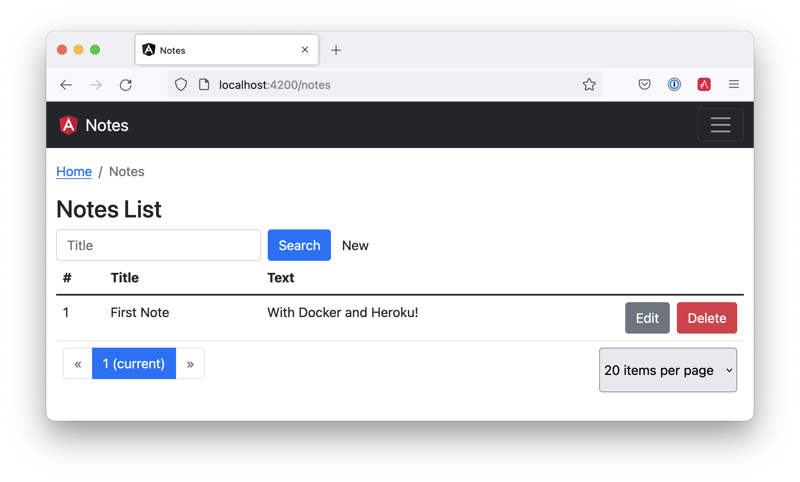
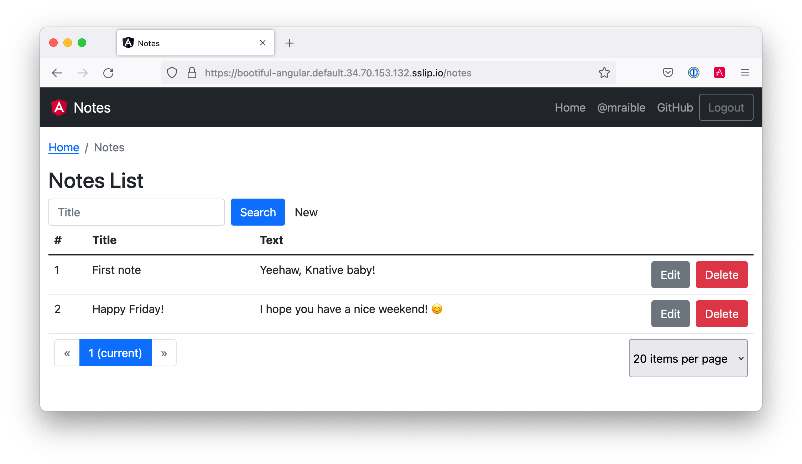

[[chapter-5]]
= Angular and Docker

[big red yellow-background]*TODO: <Deepu:Suggestion>: Is this bullet points on purpose? if so a lead line above would be nice like 'In this chapter you will learn how to:' but then the next line would seem redundant*

- Dockerize an Angular App
- Combine Angular and Spring Boot in a Single Artifact
- Build a Docker Image with Jib
- Run via Docker on Heroku, Cloud Foundry, and KNative

In this section, I'll show you how to use Docker to create an image for your Angular app and deploy it to Heroku. Then, I'll show how to combine Angular and Spring Boot into the same JAR artifact for deployment. You'll learn how to Dockerize the combined apps using Jib and Cloud Native Buildpacks. Finally, I'll show you how to deploy your Docker image to Heroku and Knative on Google Cloud.

[[angular-docker-spring-boot-hug]]
.Angular + Docker with a Big Hug from Spring Boot

Docker is the most popular way to build and share containers. _Dockerizing_ involves packaging your app — you can also include web servers to serve up your app. This is important when containerizing an Angular app because its artifacts are just JavaScript, CSS, and HTML; the production app is static files that will need to be served up by some sort of web server. As an added bonus, you can configure the web server to send security headers that make your app more secure.

// == Create an Angular + Spring Boot App

If you're following along, you should have an `angular-deployment` directory with an Angular and a Spring Boot app in it. It's a note-taking app that uses Kotlin and Spring Boot on the backend and Angular on the frontend. It's secured with OpenID Connect (OIDC).

If you'd rather start from this point, download the examples for this book from InfoQ. The `angular-deployment` directory has the previous section's completed example. Copy it to `angular-docker` in your favorite code location.

**Prerequisites:**

* https://docs.docker.com/install/[Docker]
* https://nodejs.org/[Node.js] 12+
* https://adoptopenjdk.net/[Java] 11+

// === Secure Your Angular + Spring Boot App with OpenID Connect

[big red yellow-background]*TODO: <Deepu:Suggestion>: Wasn't heroku and OIDC covered in previous chapter, this section looks redundant and out of place as well since we are talking about docker right before and after*

OAuth 2.0 was finalized in 2012 and has since become the industry-standard protocol for authorization. In 2014, OpenID Connect (OIDC) extended OAuth, adding federated identity to delegated authorization. Together, these two layers offer a standard specification that developers can write code against in a way that will work across multiple identity providers.

To begin the process of adding OIDC to Angular and Spring Boot, you'll need to https://signup.heroku.com/login[create a Heroku account]. If you already have a Heroku account, https://id.heroku.com/login[log into it]. Once you're logged in, create a new app. I named mine `bootiful-angular`.

[[heroku-create-app-recap]]
.Create Heroku app
image::../images/angular-docker/heroku-create-app.png[Create Heroku app, 700, scaledwidth="100%"]

After creating your app, click on the **Resources** tab and add the **Okta** add-on.

[[okta-add-on-docker]]
.Okta Add-On
image::../images/angular-docker/okta-add-on.png[Okta Add-On, 475, scaledwidth="100%"]

CAUTION: If you haven't entered a credit card for your Heroku account, you will get an error. This is because Heroku requires you to have a credit card on file to use any of their add-ons, even free ones. This is part of Heroku's assurance to guard against misuse (real person, real credit card, etc.). I think this is a good security practice. Add a credit card to continue.

Click **Provision** and wait 20-30 seconds while your Okta account is created and OIDC apps are registered. Now go to your app's **Settings** tab and click the **Reveal Config Vars** button. The variables displayed are the environment variables you can use to configure both Angular and Spring Boot for OIDC authentication.

[[heroku-config-vars-recap]]
.Okta Add-On
image::../images/angular-docker/heroku-config-vars.png[Okta Add-On, 800, scaledwidth="100%"]

Create an `.okta.env` file in the `angular-docker/notes-api` directory and copy the variable values into it, where `$OKTA_*` is the value from Heroku.

[source,shell]
----
export OKTA_OAUTH2_ISSUER=$OKTA_OAUTH2_ISSUER
export OKTA_OAUTH2_CLIENT_ID=$OKTA_OAUTH2_CLIENT_ID_WEB
export OKTA_OAUTH2_CLIENT_SECRET=$OKTA_OAUTH2_CLIENT_SECRET_WEB
----

[NOTE]
====
If you're on Windows without https://docs.microsoft.com/en-us/windows/wsl/install-win10[Windows Subsystem for Linux] installed, create an `okta.bat` file and use `SET` instead of `export`.
====

Start your Spring Boot app by navigating to the `notes-api` directory, sourcing this file, and running `bootRun`.

[source,shell]
----
source .okta.env
./gradlew bootRun
----

For Windows users, the commands will be:

[source,shell]
----
okta.bat
gradlew bootRun
----

Next, configure Angular for OIDC authentication by modifying its `auth-routing.module.ts` to use the generated issuer and **SPA** client ID.

[source,typescript]
.notes/src/app/auth-routing.module.ts
----
const oktaConfig = {
  issuer: '$OKTA_OAUTH2_ISSUER',
  redirectUri: '/callback',
  clientId: '$OKTA_OAUTH2_CLIENT_ID_SPA',
};
----

Install your Angular app's dependencies and start it.

[source,shell]
----
npm i
ng serve
----

Open `http://localhost:4200` in your browser.

[[angular-home-docker]]
.Angular Home
image::../images/angular-docker/angular-home.png[Angular Home, 800, scaledwidth="100%"]

Click the **Login** button in the top right corner. You should be logged in without seeing a login form because you're already logged in to Okta. If you want to see the full authentication flow, log out, or try it in a private window. You can use the `$OKTA_ADMIN_EMAIL` and `$OKTA_ADMIN_PASSWORD` from your Heroku config variables for credentials. Create a note to make sure everything works.

== Dockerize an Angular App

Create a `notes/Dockerfile` that uses NodeJS as base image and Nginx as a web server.

[source,docker]
----
FROM node:14.1-alpine AS builder

WORKDIR /opt/web
COPY package.json package-lock.json ./
RUN npm install

ENV PATH="./node_modules/.bin:$PATH"

COPY . ./
RUN ng build --prod

FROM nginx:1.17-alpine
COPY nginx.config /etc/nginx/conf.d/default.conf
COPY --from=builder /opt/web/dist/notes /usr/share/nginx/html
----

[NOTE]
====
When I was trying to get everything to work, I found it handy to comment out the `RUN ng build --prod` line and use the following instead.

[source,shell]
----
RUN mkdir -p dist/notes
RUN echo "Hello, World" > dist/notes/index.html
----

This allows you to skip the lengthy Angular build process.
====

This will build your project and add Nginx as a web server. You'll need to create the `nginx.config` file to make Nginx SPA-aware.

[source,config]
.notes/nginx.config
----
server {
    listen   80;
    server_name  _;

    root /usr/share/nginx/html;
    index index.html;

    location / {
        try_files $uri /index.html;
    }
}
----

Make sure your Docker daemon is running with `docker ps`. Then run the following command to build your Docker image. The `ng-notes` value can be whatever you want to name your image.

[source,shell]
----
docker build -t ng-notes .
----

If it builds successfully, you'll see messages like the following:

[source,shell]
----
Successfully built 382b9cd7d345
Successfully tagged ng-notes:latest
----

You can run it locally on port 4200 using the `docker run` command.

[source,shell]
----
docker run -p 4200:80 ng-notes
----

Add these Docker commands as scripts to your `package.json` file.

[source,json]
----
"docker": "docker build -t ng-notes .",
"ng-notes": "docker run -p 4200:80 ng-notes"
----

The `docker run` command will serve up the production version of the Angular app, which has its backend configured to point to a production URL on Heroku.

[source,typescript]
.notes/src/environments/environment.prod.ts
----
export const environment = {
  production: true,
  apiUrl: 'https://bootiful-angular.herokuapp.com'
};
----

You'll need to deploy your Spring Boot app to a similar public URL for your Angular + Docker container to work in production.

NOTE: If you already deployed Spring Boot to Heroku (from the last section), you can skip the next section and go straight to deploying your Angular Docker container to Heroku.

[big red yellow-background]*TODO: <Deepu:Suggestion>: Why not just ask reader to refer previous chapter since its all in one book? otherwise it might be better value to reader to show how to deploy a spring boot app as docker image to heroku instead*

=== Deploy Spring Boot to Heroku

One of the easiest ways to interact with Heroku is with the Heroku CLI. https://devcenter.heroku.com/articles/heroku-cli[Install it] before proceeding with the instructions below.

[source,shell]
----
brew tap heroku/brew && brew install heroku
----

Open a terminal and log in to your Heroku account.

[source,shell]
----
heroku login
----

You should already have a Heroku app that you've added Okta to. You can use it for hosting your Spring Boot app. Run `heroku apps` and you'll see the one that you created.

[source,shell]
----
$ heroku apps
=== mraible@gmail.com Apps
bootiful-angular
----

You can run `heroku config -a $APP_NAME` to see your Okta variables. In my case, I'll be using `bootiful-angular` for `$APP_NAME`.

Associate your existing Git repo with the app on Heroku.

[source,shell]
----
heroku git:remote -a $APP_NAME
----

Set the `APP_BASE` config variable to point to the `notes-api` directory. While you're there, add the monorepo and Gradle buildpacks.

[source,shell]
----
heroku config:set APP_BASE=notes-api
heroku buildpacks:add https://github.com/lstoll/heroku-buildpack-monorepo
heroku buildpacks:add heroku/gradle
----

Attach a PostgreSQL database to your app.

[source,shell]
----
heroku addons:create heroku-postgresql
----

By default, https://devcenter.heroku.com/articles/deploying-gradle-apps-on-heroku[Heroku's Gradle support] runs `./gradlew build -x test`. Since you want it to run `./gradlew bootJar -Pprod`, you'll need to override it by setting a `GRADLE_TASK` config var.

[source,shell]
----
heroku config:set GRADLE_TASK="bootJar -Pprod"
----

The `$OKTA_*` environment variables don't have the same names as the Okta Spring Boot starter expects. This is because the Okta Heroku Add-On creates two apps: a SPA and a web app. The web app's config variables end in `_WEB`. You'll have to make some changes so those variables are used for the Okta Spring Boot starter. Run the following command and remove `_WEB` from the two variables that have it.

[source,shell]
----
heroku config:edit
----

Now you're ready to deploy! Heroku makes this easy with a simple `git push`.

[source,shell]
----
git push heroku main:master
----

Run `heroku open` to open your app. You'll be redirected to Okta to authenticate, then back to your Spring Boot app. You should see a screen like the one below.

[[heroku-hello-docker]]
.Hello on Heroku
image::../images/angular-docker/heroku-hello.png[Hello on Heroku, 800, scaledwidth="100%"]

By default, JPA is configured to create your database schema each time. Change it to simply validate the schema.

[source,shell]
----
heroku config:set SPRING_JPA_HIBERNATE_DDL_AUTO=validate
----

Now, you'll need to configure your Angular app to use your Heroku-deployed Spring Boot app for its production URL.

[source,typescript]
.notes/src/environments/environment.prod.ts
----
export const environment = {
  production: true,
  apiUrl: 'https://<your-heroku-app>.herokuapp.com'
};
----

Since this runs the production build, you'll need to add `\http://localhost:4200` as an allowed origin in your Spring Boot app on Heroku. Run the following command and add it to the end of the existing values.

[source,shell]
----
heroku config:set ALLOWED_ORIGINS=http://localhost:4200
----

TIP: One advantage of doing this is that you can run your local Angular app against your production backend. I've found this very useful when debugging and fixing UI issues caused by production data.

Now you should be able to rebuild your Angular Docker container and run it.

[source,shell]
----
npm run docker
npm run ng-notes
----

Open your browser to `http://localhost:4200`, log in, and confirm you can add notes.

[[first-note-on-heroku]]
.First Note on Heroku

Verify the data made it to Heroku by going to `\https://<your-heroku-app>.herokuapp.com/api/notes`.

=== Deploy Angular + Docker to Heroku

Heroku has  https://devcenter.heroku.com/articles/container-registry-and-runtime[several slick features when it comes to Docker images]. If your project has a `Dockerfile`, you can deploy your app directly using the Heroku Container Registry.

First, make sure you're in the `notes` directory, then log in to the Container Registry.

[source,shell]
----
heroku container:login
----

Then, create a new app.

[source,shell]
----
heroku create
----

Add the Git URL as a new remote named `docker`.

[source,shell]
----
git remote add docker https://git.heroku.com/<your-app-name>.git
----

You'll need to update `nginx.config` so it reads from a `$PORT` environment variable if it's set, otherwise default it to 80. You can use https://michalzalecki.com/nginx-listen-on-port-docker/[`envsubst` to do this at runtime]. However, the default `envsubst` doesn't allow default variables. The good news is https://github.com/a8m/envsubst[a8m/envsubst] on GitHub does!

Replace your `nginx.config` with the following configuration that defaults to 80 and escapes the `$uri` variable so it's not replaced with a blank value.

[source,config]
.notes/nginx.config
----
server {
    listen       ${PORT:-80};
    server_name  _;

    root /usr/share/nginx/html;
    index index.html;

    location / {
        try_files $$uri /index.html;
    }
}
----

You'll also need to update your `Dockerfile` so it uses the aforementioned `envsubst`.

[source,docker]
.notes/Dockerfile
----
FROM node:14.1-alpine AS builder

WORKDIR /opt/web
COPY package.json package-lock.json ./
RUN npm install

ENV PATH="./node_modules/.bin:$PATH"

COPY . ./
RUN ng build --prod

FROM nginx:1.17-alpine
RUN apk --no-cache add curl
RUN curl -L https://github.com/a8m/envsubst/releases/download/v1.1.0/envsubst-`uname -s`-`uname -m` -o envsubst && \
    chmod +x envsubst && \
    mv envsubst /usr/local/bin
COPY ./nginx.config /etc/nginx/nginx.template
CMD ["/bin/sh", "-c", "envsubst < /etc/nginx/nginx.template > /etc/nginx/conf.d/default.conf && nginx -g 'daemon off;'"]
COPY --from=builder /opt/web/dist/notes /usr/share/nginx/html
----

Then, push your Docker image to Heroku's Container Registry.

[source,shell]
----
heroku container:push web --remote docker
----

Once the push process has completed, release the image of your app:

[source,shell]
----
heroku container:release web --remote docker
----

And open the app in your browser:

[source,shell]
----
heroku open --remote docker
----

You'll need to add your app's URL to Okta as a valid redirect URI. In your Spring Boot app on Heroku, go to **Resources** and click on the **Okta** add-on. This will log you in to your Okta dashboard. Navigate to **Applications** > **SPA** > **General** > **Edit**. Add the following redirect URIs.

- Login: `\https://<angular-docker-app>.herokuapp.com/callback`
- Logout: `\https://<angular-docker-app>.herokuapp.com`

You'll need to add the new app's URL as an allowed origin in your Spring Boot app on Heroku. Copy the printed `Hosting URL` value and run the following command.

[source,shell]
----
heroku config:edit --remote heroku
----

Add the new URL after your existing `localhost` one, separating them with a comma. For example:

[source,shell]
----
ALLOWED_ORIGINS='http://localhost:4200,https://<angular-docker-app>.herokuapp.com'
----

Now you should be able to log in and see the note you created earlier.

=== A-Rated Security Headers for Nginx in Docker

If you test your freshly-deployed Angular app with https://securityheaders.com/[securityheaders.com], you'll get an **F**. To solve this, modify your `nginx.config` to add security headers.

[source,config]
.notes/nginx.conf
----
server {
    listen       ${PORT:-80};
    server_name  _;

    root /usr/share/nginx/html;
    index index.html;

    location / {
        try_files $$uri /index.html;
    }

    add_header Content-Security-Policy "default-src 'self'; script-src 'self' 'unsafe-eval'; style-src 'self' 'unsafe-inline'; img-src 'self' data:; font-src 'self' data:; frame-ancestors 'none'; connect-src 'self' https://*.okta.com https://*.herokuapp.com";
    add_header Referrer-Policy "no-referrer, strict-origin-when-cross-origin";
    add_header Strict-Transport-Security "max-age=63072000; includeSubDomains";
    add_header X-Content-Type-Options nosniff;
    add_header X-Frame-Options DENY;
    add_header X-XSS-Protection "1; mode=block";
    add_header Feature-Policy "accelerometer 'none'; camera 'none'; microphone 'none'";
}
----

After updating this file, run the following commands:

[source,shell]
----
heroku container:push web --remote docker
heroku container:release web --remote docker
----

Now you should get an **A**!

[[angular-docker-securityheaders]]
.Nginx in Docker score from securityheaders.com

Commit your changes to Git.

[source,shell]
----
git add .
git commit -m "Add Docker for Angular"
----

== Combine Angular and Spring Boot in a Single Artifact

In the previous sections, you learned how to deploy your Angular and Spring Boot apps separately. Now I'll show you how to combine them into a single JAR for production. You'll still be able to run them independently in development, but deploying them to production will be easier because you won't have to worry about CORS (cross-origin resource sharing). I'll also convert the OAuth flows so they all happen server-side, which is more secure as the access token won't be stored in the browser.

NOTE: Most client-side OAuth libraries keep access tokens in local storage. However, there is a https://gitlab.com/jimdigriz/oauth2-worker[oauth2-worker] project that allows you to store them in a web worker. There's also folks that think https://pragmaticwebsecurity.com/articles/oauthoidc/localstorage-xss.html[avoiding LocalStorage for tokens is the wrong solution].

=== Update Your Angular App's Authentication Mechanism

Create a new `AuthService` service that will communicate with your Spring Boot API for authentication logic.

====
[source,typescript]
.notes/src/app/shared/auth.service.ts
----
import { Injectable } from '@angular/core';
import { Location } from '@angular/common';
import { BehaviorSubject, Observable } from 'rxjs';
import { HttpClient, HttpHeaders } from '@angular/common/http';
import { environment } from '../../environments/environment';
import { User } from './user';
import { map } from 'rxjs/operators';

const headers = new HttpHeaders().set('Accept', 'application/json');

@Injectable({
  providedIn: 'root'
})
export class AuthService {
  $authenticationState = new BehaviorSubject<boolean>(false);

  constructor(private http: HttpClient, private location: Location) {
  }

  getUser(): Observable<User> {
    return this.http.get<User>(`${environment.apiUrl}/user`, {headers}).pipe( // <1>
      map((response: User) => {
        this.$authenticationState.next(true);
        return response;
      })
    );
  }

  isAuthenticated(): Promise<boolean> {
    return this.getUser().toPromise().then((user: User) => {
      return user !== undefined;
    }).catch(() => {
      return false;
    })
  }

  login(): void { // <2>
    location.href = `${location.origin}${this.location.prepareExternalUrl('oauth2/authorization/okta')}`;
  }

  logout(): void { // <3>
    const redirectUri = `${location.origin}${this.location.prepareExternalUrl('/')}`;

    this.http.post(`${environment.apiUrl}/api/logout`, {}).subscribe((response: any) => {
      location.href = response.logoutUrl + '?id_token_hint=' + response.idToken
        + '&post_logout_redirect_uri=' + redirectUri;
    });
  }
}
----
<.> Talk to the `/user` endpoint to determine authenticated status. A username will be returned if the user is logged in.
<.> When the user clicks a login button, redirect them to a Spring Security endpoint to do the OAuth dance.
<.> Logout using the `/api/logout` endpoint, which returns the Okta Logout API URL and a valid ID token.
====

Create a `user.ts` file in the same directory, to hold your `User` model.

[source,typescript]
.notes/src/app/shared/user.ts
----
export class User {
  sub!: number;
  fullName!: string;
}
----

Update `app.component.ts` to use your new `AuthService` in favor of `OktaAuthService`.

[source,typescript]
.notes/src/app/app.component.ts
----
import { Component, OnInit } from '@angular/core';
import { AuthService } from './shared/auth.service';

@Component({
  selector: 'app-root',
  templateUrl: './app.component.html',
  styleUrls: ['./app.component.scss']
})
export class AppComponent implements OnInit {
  title = 'Notes';
  isAuthenticated: boolean = false;
  isCollapsed = true;

  constructor(public auth: AuthService) {
  }

  async ngOnInit() {
    this.isAuthenticated = await this.auth.isAuthenticated();
    this.auth.$authenticationState.subscribe(
      (isAuthenticated: boolean) => this.isAuthenticated = isAuthenticated
    );
  }
}
----

Remove `OktaAuthModule` and its related code from `app.component.spec.ts` and `home.component.spec.ts`. You'll also need to add `HttpClientTestingModule` to their `TestBed` imports.

Change the buttons in `app.component.html` to reference the `auth` service instead of `oktaAuth`.

[source,html]
.notes/src/app/app.component.html
----
<button *ngIf="!isAuthenticated" (click)="auth.login()"
        class="btn btn-outline-primary" id="login">Login</button>
<button *ngIf="isAuthenticated" (click)="auth.logout()"
        class="btn btn-outline-secondary" id="logout">Logout</button>
----

Update `home.component.ts` to use `AuthService` too.

[source,typescript]
.notes/src/app/home/home.component.ts
----
import { Component, OnInit } from '@angular/core';
import { AuthService } from '../shared/auth.service';

@Component({
  selector: 'app-home',
  templateUrl: './home.component.html',
  styleUrls: ['./home.component.scss']
})
export class HomeComponent implements OnInit {
  isAuthenticated: boolean;

  constructor(public auth: AuthService) {
  }

  async ngOnInit() {
    this.isAuthenticated = await this.auth.isAuthenticated();
  }
}
----

Delete `notes/src/app/auth-routing.module.ts` and `notes/src/app/shared/okta`.

Modify `app.module.ts` to remove the `AuthRoutingModule` import, add `HomeComponent` as a declaration, and import `HttpClientModule`.

[source,typescript]
.notes/src/app/app.module.ts
----
import { BrowserModule } from '@angular/platform-browser';
import { NgModule } from '@angular/core';

import { AppRoutingModule } from './app-routing.module';
import { AppComponent } from './app.component';
import { NoteModule } from './note/note.module';
import { NgbModule } from '@ng-bootstrap/ng-bootstrap';
import { HomeComponent } from './home/home.component';
import { HttpClientModule } from '@angular/common/http';

@NgModule({
  declarations: [
    AppComponent,
    HomeComponent
  ],
  imports: [
    BrowserModule,
    AppRoutingModule,
    HttpClientModule,
    NoteModule,
    NgbModule
  ],
  providers: [],
  bootstrap: [AppComponent]
})
export class AppModule { }
----

Add the route for `HomeComponent` to `app-routing.module.ts`.

[source,typescript]
.notes/src/app/app-routing.module.ts
----
import { HomeComponent } from './home/home.component';

const routes: Routes = [
  { path: '', redirectTo: '/home', pathMatch: 'full' },
  {
    path: 'home',
    component: HomeComponent
  }
];
----

Change both `environments.ts` and `environments.prod.ts` to use a blank `apiUrl`.

[source,typescript]
----
apiUrl: ''
----

Create a `proxy.conf.js` file to proxy certain requests to your Spring Boot API on `\http://localhost:8080`.

[source,javascript]
.notes/src/proxy.conf.js
----
const PROXY_CONFIG = [
  {
    context: ['/user', '/api', '/oauth2', '/login'],
    target: 'http://localhost:8080',
    secure: false,
    logLevel: 'debug'
  }
]

module.exports = PROXY_CONFIG;
----

Add this file as a `proxyConfig` option in `angular.json`.

[source,json]
.notes/angular.json
----
"serve": {
  "builder": "@angular-devkit/build-angular:dev-server",
  "options": {
    "browserTarget": "notes:build",
    "proxyConfig": "src/proxy.conf.js"
  },
  ...
},
----

Remove Okta's Angular SDK and OktaDev Schematics from your Angular project.

[source,shell]
----
npm uninstall @okta/okta-angular @oktadev/schematics
----

At this point, your Angular app doesn't contain any Okta-specific code for authentication. Instead, it relies  on your Spring Boot app to provide that.

You should still be able to run `ng serve` in your Angular app and `./gradlew bootRun` in your Spring Boot app for local development. However, you'll need to make some adjustments to your Spring Boot app to include Angular for production.

=== Configure Spring Boot to Include Your Angular SPA

In your Spring Boot app, you'll need to change a number of things. You'll need to configure Gradle to build your Angular app when you pass in `-Pprod`, you'll need to adjust its routes (so it's SPA-aware and routes all 404s to `index.html`), and you'll need to modify Spring Security to allow HTML, CSS, and JavaScript to be anonymously accessed.

To begin, delete `src/main/kotlin/com/okta/developer/notes/HomeController.kt`. You'll no longer need this because your Angular app will be served up at the `/` path.

Next, create a `RouteController.kt` that routes all requests to `index.html`.

[source,kotlin]
.notes-api/src/main/kotlin/com/okta/developer/notes/RouteController.kt
----
package com.okta.developer.notes

import org.springframework.stereotype.Controller
import org.springframework.web.bind.annotation.RequestMapping
import javax.servlet.http.HttpServletRequest

@Controller
class RouteController {

    @RequestMapping(value = ["/{path:[^\\.]*}"])
    fun redirect(request: HttpServletRequest): String {
        return "forward:/"
    }
}
----

Modify `SecurityConfiguration.kt` to allow anonymous access to static web files, the `/user` info endpoint, and to add additional security headers.

[source,kotlin]
.notes-api/src/main/kotlin/com/okta/developer/notes/SecurityConfiguration.kt
----
package com.okta.developer.notes

import org.springframework.security.config.annotation.web.builders.HttpSecurity
import org.springframework.security.config.annotation.web.configuration.EnableWebSecurity
import org.springframework.security.config.annotation.web.configuration.WebSecurityConfigurerAdapter
import org.springframework.security.web.csrf.CookieCsrfTokenRepository
import org.springframework.security.web.header.writers.ReferrerPolicyHeaderWriter
import org.springframework.security.web.util.matcher.RequestMatcher

@EnableWebSecurity
class SecurityConfiguration : WebSecurityConfigurerAdapter() {

    override fun configure(http: HttpSecurity) {
        //@formatter:off
        http
            .authorizeRequests()
                .antMatchers("/**/*.{js,html,css}").permitAll()
                .antMatchers("/", "/user").permitAll()
                .anyRequest().authenticated()
                .and()
            .oauth2Login()
                .and()
            .oauth2ResourceServer().jwt()

        http.requiresChannel()
                .requestMatchers(RequestMatcher {
                    r -> r.getHeader("X-Forwarded-Proto") != null
                }).requiresSecure()

        http.csrf()
                .csrfTokenRepository(CookieCsrfTokenRepository.withHttpOnlyFalse())

        http.headers()
                .contentSecurityPolicy("script-src 'self'; report-to /csp-report-endpoint/")
                .and()
                .referrerPolicy(ReferrerPolicyHeaderWriter.ReferrerPolicy.SAME_ORIGIN)
                .and()
                .featurePolicy("accelerometer 'none'; camera 'none'; microphone 'none'")

        //@formatter:on
    }
}
----

TIP: See https://docs.spring.io/spring-security/site/docs/current/reference/html5/#headers[Spring Security's headers] documentation to see default security headers and other options.

With Kotlin, you can mark parameters and return values as optional by adding `?` to their type. Update the `user()` method in `UserController.kt` to make `OidcUser` optional. It will be `null` when the user is not authenticated, that's why this change is needed.

[source,kotlin]
.notes-api/src/main/kotlin/com/okta/developer/notes/UserController.kt
----
@GetMapping("/user")
fun user(@AuthenticationPrincipal user: OidcUser?): OidcUser? {
    return user;
}
----

Previously, Angular handled logout. Add a `LogoutController` that will handle expiring the session as well as sending information back to Angular so it can sign out from Okta.

[source,kotlin]
.notes-api/src/main/kotlin/com/okta/developer/notes/LogoutController.kt
----
package com.okta.developer.notes

import org.springframework.http.ResponseEntity
import org.springframework.security.core.annotation.AuthenticationPrincipal
import org.springframework.security.oauth2.client.registration.ClientRegistration
import org.springframework.security.oauth2.client.registration.ClientRegistrationRepository
import org.springframework.security.oauth2.core.oidc.OidcIdToken
import org.springframework.web.bind.annotation.PostMapping
import org.springframework.web.bind.annotation.RestController
import javax.servlet.http.HttpServletRequest

@RestController
class LogoutController(clientRegistrationRepository: ClientRegistrationRepository) {

    val registration: ClientRegistration = clientRegistrationRepository.findByRegistrationId("okta");

    @PostMapping("/api/logout")
    fun logout(request: HttpServletRequest,
               @AuthenticationPrincipal(expression = "idToken") idToken: OidcIdToken): ResponseEntity<*> {
        val logoutUrl = this.registration.providerDetails.configurationMetadata["end_session_endpoint"]
        val logoutDetails: MutableMap<String, String> = HashMap()
        logoutDetails["logoutUrl"] = logoutUrl.toString()
        logoutDetails["idToken"] = idToken.tokenValue
        request.session.invalidate()
        return ResponseEntity.ok().body<Map<String, String>>(logoutDetails)
    }
}
----

[big red yellow-background]*TODO: <Deepu:Suggestion>: Link seems incomplete*

NOTE: In link:/blog/2020/03/27/spring-oidc-logout-options[OpenID Connect Logout Options with Spring Boot], Brian Demers describes this as RP-Initiated Logout. He also shows how you can configure Spring Security's `OidcClientInitiatedLogoutSuccessHandler` to logout. I tried this technique but decided against it because it doesn't allow me to redirect back to my Angular app in dev mode. I also encountered some CORS errors that I was unable to solve.

When you access the `/user/notes` endpoint with Angular, the `${principal.name}` expression correctly resolves to the user's email. However, when you access this endpoint after logging in directly to Spring Boot, it resolves to the `sub` claim. To make these values consistent, add the following property to `application-dev.properties` and `application-prod.properties`.

[source,properties]
----
spring.security.oauth2.client.provider.okta.user-name-attribute=preferred_username
----

You can also remove the `allowed.origins` property from both files since Angular will proxy the request in development (eliminating the need for CORS) and there won't be cross-domain requests in production.

Add a `server.port` property to `application-prod.properties` that uses a `PORT` environment variable, if it's set.

[source,properties]
----
server.port=${PORT:8080}
----

Because there won't be any cross-domain requests, you can remove the `simpleCorsFilter` bean and `allowedOrigins` variable in `DemoApplication.kt`, too.

=== Modify Gradle to Build a JAR with Angular Included

Now that your Spring Boot app is ready to serve up your Angular app, you need to modify your Gradle configuration to build your Angular app and package it in the JAR.

Start by importing `NpxTask` and adding the Node Gradle plugin.

[source,kotlin]
.notes/build.gradle.kts
----
import com.github.gradle.node.npm.task.NpxTask

plugins {
    ...
    id("com.github.node-gradle.node") version "3.1.0"
    ...
}
----

Then, define the location of your Angular app and configuration for the Node plugin.

[source,kotlin]
----
val spa = "${projectDir}/../notes";

node {
    version.set("14.17.1")
    nodeProjectDir.set(file(spa))
}
----

Add a `buildWeb` task:

[source,kotlin]
----
val buildWeb = tasks.register<NpmTask>("buildNpm") {
    dependsOn(tasks.npmInstall)
    command.set("build")
    inputs.dir("${spa}/src")
    inputs.dir(fileTree("${spa}/node_modules").exclude("${spa}/.cache"))
    outputs.dir("${spa}/dist")
}
----

And modify the `processResources` task to build Angular when `-Pprod` is passed in.

[source,kotlin]
----
tasks.processResources {
    rename("application-${profile}.properties", "application.properties")
    if (profile == "prod") {
        dependsOn(buildWeb)
        from("${spa}/dist/notes") {
            into("static")
        }
    }
}
----

Now you should be able to combine both apps using `./gradlew bootJar -Pprod`. Once it's built, run it with the following commands to ensure everything works.

[source,shell]
----
docker-compose -f src/main/docker/postgresql.yml up -d
source .okta.env
java -jar build/libs/*.jar
----

Congrats! You modified your Angular and Spring Boot apps to be packaged together and implemented the most secure form of OAuth 2.0 to boot!

== Build a Docker Image with Jib

Since everything is done via Gradle now, you can use plugins to build a Docker container. https://github.com/GoogleContainerTools/jib[Jib] builds optimized Docker images without the need for deep mastery of Docker best-practices. It reads your Gradle/Maven build files for its metadata.

To add Jib support, add its Gradle plugin.

[source,kotlin]
.notes/build.gradle.kts
----
plugins {
    ...
    id("com.google.cloud.tools.jib") version "3.1.1"
}
----

Then, at the end of this file, add `jib` configuration to specify your image name and the active Spring profile.

[source,kotlin]
----
jib {
    to {
        image = "<your-username>/bootiful-angular"
    }
    container {
        environment = mapOf("SPRING_PROFILES_ACTIVE" to profile)
    }
}
----

Run the following command to build a Docker image with Jib.

[source,shell]
----
./gradlew jibDockerBuild -Pprod
----

TIP: If you want to override the image name in `build.gradle.kts`, you can pass in an `--image` parameter. For example, `./gradlew jibDockerBuild -Pprod --image=bootiful-ng9`.

=== Run Your Spring Boot Docker App with Docker Compose

In theory, you should be able to run the following command to run your app.

[source,shell]
----
docker run --publish=8080:8080 <your-username>/bootiful-angular
----

However, Spring Boot won't start because you haven't configured the Okta environment variables. You could pass them in on the command line, but it's easier to specify them in a file.

You can https://docs.docker.com/compose/compose-file/#env_file[use Docker Compose and its `env_file` option] to specify environment variables.

Copy `notes-api/okta.env` to `src/main/docker/.env`.

Remove `export` at the beginning of each line. It should resemble something like the following after this change:

[source,shell]
----
OKTA_OAUTH2_ISSUER=https://dev-133337.okta.com/oauth2/default
OKTA_OAUTH2_CLIENT_ID=0oaa7psy...
OKTA_OAUTH2_CLIENT_SECRET=FJcSFpTC6N...
----

Create a `src/main/docker/app.yml` file that configures your app to set environment variables and leverages your existing PostgreSQL container. Make sure to replace the `<your-username>` placeholder and make the image match what's in your `build.gradle.kts` file.

[source,yaml]
----
version: '3'
services:
  boot-app:
    image: <your-username>/bootiful-angular
    environment:
      - SPRING_DATASOURCE_URL=jdbc:postgresql://notes-postgresql:5432/notes
      - OKTA_OAUTH2_ISSUER=${OKTA_OAUTH2_ISSUER}
      - OKTA_OAUTH2_CLIENT_ID=${OKTA_OAUTH2_CLIENT_ID}
      - OKTA_OAUTH2_CLIENT_SECRET=${OKTA_OAUTH2_CLIENT_SECRET}
    ports:
      - 8080:8080
    depends_on:
      - notes-postgresql
  notes-postgresql:
    extends:
      file: postgresql.yml
      service: notes-postgresql
----

Docker Compose expects the `.env` file to be in the directory you run `docker-compose` from, so you have two choices:

1. Navigate to the `src/main/docker` directory before running `docker-compose`
2. Create a symlink to `.env` in your root directory: `ln -s src/main/docker/.env`

If you choose option #1, run:

[source,shell]
----
cd src/main/docker
docker-compose -f app.yml up
----

Option #2 looks like:

[source,shell]
----
docker-compose -f src/main/docker/app.yml up
----

Once you've verified everything works, commit your changes to Git.

[source,shell]
----
git add .
git commit -m "Add Jib to build Docker images"
----

=== Deploy Your Spring Boot + Angular Container to Docker Hub

Jib makes it incredibly easy to deploy your container to Docker Hub. If you don't already have a Docker Hub account, you can https://hub.docker.com/signup[create one].

Run `docker login` to log into your account, then use the `jib` task to build *and* deploy your image.

[source,shell]
----
./gradlew jib -Pprod
----

Isn't it cool how Jib makes it so you don't need a `Dockerfile`!?

== Run via Docker on Heroku and KNative

To deploy this container to Heroku, create a new Heroku app and add it as a Git remote.

[source,shell]
----
heroku create
git remote add jib https://git.heroku.com/<your-new-app>.git
----

At this point, you can use the PostgreSQL and Okta add-ons you've already configured. If you'd like to do this, use `addons:attach` instead of `addons:create` in the following commands. Since both add-ons are free, I'm just going to show how to create new ones.

Add PostgreSQL to this app and configure it for Spring Boot using the following commands:

[source,shell]
----
heroku addons:create heroku-postgresql --remote jib
heroku config:get DATABASE_URL --remote jib
heroku config:set SPRING_DATASOURCE_URL=jdbc:postgresql://<value-after-@-from-last-command> --remote jib
heroku config:set SPRING_DATASOURCE_USERNAME=<username-value-from-last-command> --remote jib
heroku config:set SPRING_DATASOURCE_PASSWORD=<password-value-from-last-command> --remote jib
heroku config:set SPRING_DATASOURCE_DRIVER_CLASS_NAME=org.postgresql.Driver --remote jib
----

NOTE: This fine-grained configuration is not necessary when you use Heroku's buildpacks to deploy your Spring Boot app. It injects scripts that set `SPRING_*` environment variables for you. In this case, Heroku doesn't know you're using Spring Boot since it's running in a container.

Add Okta to your app.

[source,shell]
----
heroku addons:create okta --remote jib
----

To see your database and Okta environment variables, run:

[source,shell]
----
heroku config --remote jib
----

Modify the Okta environment variables to remove the `_WEB` on the two keys that have it.

[source,shell]
----
heroku config:edit --remote jib
----

Run the commands below to deploy the image you deployed to Docker Hub. Be sure to replace the `<...>` placeholders with your username and app name.

[source,shell]
----
docker tag <your-username>/bootiful-angular registry.heroku.com/<heroku-app>/web
docker push registry.heroku.com/<heroku-app>/web
heroku container:release web --remote jib
----

For example, I used:

[source,shell]
----
docker tag mraible/bootiful-angular registry.heroku.com/enigmatic-woodland-19325/web
docker push registry.heroku.com/enigmatic-woodland-19325/web
heroku container:release web --remote jib
----

You can watch the logs to see if your container started successfully.

[source,shell]
----
heroku logs --tail --remote jib
----

Once you've verified it has started OK, set the Hibernate configuration so it only validates the schema.

[source,shell]
----
heroku config:set SPRING_JPA_HIBERNATE_DDL_AUTO=validate --remote jib
----

Since the Okta Add-on for Heroku configures everything for you, you should be able to open your app, click the **Login** button, and authenticate!

[source,shell]
----
heroku open --remote jib
----

If you test your Dockerfied Angular + Spring Boot app on securityheaders.com, you'll see it scores an **A+**!

[big red yellow-background]*TODO: <Deepu:Suggestion>: Missing image??*

[[heroku-jib-headers-a+]]
.A+ Security Headers
image::../images/angular-docker/heroku-jib-headers-a+.png[A+ Security Headers, 800, scaledwidth="100%"]

=== Knative with Spring Boot + Docker

[big red yellow-background]*TODO: <Deepu:Suggestion>: This section would be an overkill for a monolith IMO, so may be note might be nice IMO?*

Heroku is awesome, but sometimes people want more control over their infrastructure. Enter Knative. It's like Heroku in that it's a Platform as a Service (PaaS). Knative is built on top of Kubernetes, so you can install a number of services with a bit of YAML and `kubectl` commands.

With Heroku, when companies reach the limitations of the platform, they have to go elsewhere to host their services. With Knative, you can just drop down to Kubernetes. It's Heroku for Kubernetes in a sense, but you don't have to switch to a different universe when you need additional functionality.

The https://knative.dev/[Knative website] says it'll make your developers more productive.

> Knative components build on top of Kubernetes, abstracting away the complex details and enabling developers to focus on what matters. Built by codifying the best practices shared by successful real-world implementations, Knative solves the "boring but difficult" parts of deploying and managing cloud native services, so you don't have to.

You'll need a Google Cloud account for this section. Go to https://cloud.google.com/[cloud.google.com] and click **Get started for free**.

Once you have an account, go to https://console.cloud.google.com/[Google Cloud Console] and create a new project.

Then, click on the Terminal icon in the top right to open a Cloud Shell terminal for your project.

Enable Cloud and Container APIs:

[source,shell]
----
gcloud services enable \
  cloudapis.googleapis.com \
  container.googleapis.com \
  containerregistry.googleapis.com
----

NOTE: This command can take a minute or two to complete.

When it's done, set your default zone and region:

[source,shell]
----
gcloud config set compute/zone us-central1-c
gcloud config set compute/region us-central1
----

And create a Kubernetes cluster:

[source,shell]
----
gcloud beta container clusters create knative \
  --addons=HorizontalPodAutoscaling,HttpLoadBalancing \
  --machine-type=n1-standard-4 \
  --cluster-version=1.15 \
  --enable-stackdriver-kubernetes --enable-ip-alias \
  --enable-autoscaling --min-nodes=5 --num-nodes=5 --max-nodes=10 \
  --enable-autorepair \
  --scopes cloud-platform
----

_You can safely ignore the warnings that result from running this command._

Next, set up a cluster administrator and install Istio.

[source,shell]
----
kubectl create clusterrolebinding cluster-admin-binding \
  --clusterrole=cluster-admin \
  --user=$(gcloud config get-value core/account)

kubectl apply -f \
https://github.com/knative/serving/raw/v0.14.0/third_party/istio-1.5.1/istio-crds.yaml

while [[ $(kubectl get crd gateways.networking.istio.io -o jsonpath='{.status.conditions[?(@.type=="Established")].status}') != 'True' ]]; do
  echo "Waiting on Istio CRDs"; sleep 1
done

kubectl apply -f \
https://github.com/knative/serving/raw/v0.14.0/third_party/istio-1.5.1/istio-minimal.yaml
----

Now, you should be able to install Knative!

[source,shell]
----
kubectl apply --selector knative.dev/crd-install=true -f \
 https://github.com/knative/serving/releases/download/v0.14.0/serving.yaml

kubectl apply -f \
 https://github.com/knative/serving/releases/download/v0.14.0/serving.yaml

while [[ $(kubectl get svc istio-ingressgateway -n istio-system \
  -o 'jsonpath={.status.loadBalancer.ingress[0].ip}') == '' ]]; do
  echo "Waiting on external IP"; sleep 1
done
----

You'll need a domain to enable HTTPS, so set that up and point it to the cluster's IP address.

[source,shell]
----
export IP_ADDRESS=$(kubectl get svc istio-ingressgateway -n istio-system \
  -o 'jsonpath={.status.loadBalancer.ingress[0].ip}')
echo $IP_ADDRESS

kubectl apply -f - <<EOF
apiVersion: v1
kind: ConfigMap
metadata:
  name: config-domain
  namespace: knative-serving
data:
  $IP_ADDRESS.nip.io: ""
EOF
----

Install https://cert-manager.io/[cert-manager] to automatically provision and manage TLS certificates in Kubernetes.

[source,shell]
----
kubectl apply --validate=false -f \
 https://github.com/jetstack/cert-manager/releases/download/v0.14.3/cert-manager.yaml

kubectl wait --for=condition=Available -n cert-manager deployments/cert-manager-webhook
----

And configure free TLS certificate issuing with https://letsencrypt.org/[Let's Encrypt].
// todo: see if there's a newer apiVersion
[source,shell]
----
kubectl apply -f - <<EOF
apiVersion: cert-manager.io/v1alpha2
kind: ClusterIssuer
metadata:
  name: letsencrypt-http01-issuer
spec:
  acme:
    privateKeySecretRef:
      name: letsencrypt
    server: https://acme-v02.api.letsencrypt.org/directory
    solvers:
    - http01:
       ingress:
         class: istio
EOF

kubectl apply -f \
https://github.com/knative/serving/releases/download/v0.14.0/serving-cert-manager.yaml

kubectl apply -f - <<EOF
apiVersion: v1
kind: ConfigMap
metadata:
  name: config-certmanager
  namespace: knative-serving
data:
  issuerRef: |
    kind: ClusterIssuer
    name: letsencrypt-http01-issuer
EOF

kubectl apply -f - <<EOF
apiVersion: v1
kind: ConfigMap
metadata:
  name: config-network
  namespace: knative-serving
data:
  autoTLS: Enabled
  httpProtocol: Enabled
EOF
----

_Phew!_ That was a lot of `kubectl` and YAML, don't you think?! The good news is you're ready to deploy PostgreSQL and your Spring Boot app.

The following command can deploy everything, but you'll need to change the `<...>` placeholders to match your values first.
// todo: is there a newer version of apiVersion: serving.knative.dev/v1alpha1?
[source,shell]
----
kubectl apply -f - <<EOF
apiVersion: v1
kind: PersistentVolumeClaim
metadata:
  name: pgdata
  annotations:
    volume.alpha.kubernetes.io/storage-class: default
spec:
  accessModes: [ReadWriteOnce]
  resources:
    requests:
      storage: 1Gi
---
apiVersion: apps/v1beta1
kind: Deployment
metadata:
  name: postgres
spec:
  replicas: 1
  template:
    metadata:
      labels:
        service: postgres
    spec:
      containers:
        - name: postgres
          image: postgres:13.3
          ports:
            - containerPort: 5432
          env:
            - name: POSTGRES_DB
              value: bootiful-angular
            - name: POSTGRES_USER
              value: bootiful-angular
            - name: POSTGRES_PASSWORD
              value: <your-db-password>
          volumeMounts:
            - mountPath: /var/lib/postgresql/data
              name: pgdata
              subPath: data
      volumes:
        - name: pgdata
          persistentVolumeClaim:
            claimName: pgdata
---
apiVersion: v1
kind: Service
metadata:
  name: pgservice
spec:
  ports:
  - port: 5432
    name: pgservice
  clusterIP: None
  selector:
    service: postgres
---
apiVersion: serving.knative.dev/v1alpha1
kind: Service
metadata:
  name: bootiful-angular
spec:
  template:
    spec:
      containers:
        - image: <your-username>/bootiful-angular
          env:
          - name: SPRING_DATASOURCE_URL
            value: jdbc:postgresql://pgservice:5432/bootiful-angular
          - name: SPRING_DATASOURCE_USERNAME
            value: bootiful-angular
          - name: SPRING_DATASOURCE_PASSWORD
            value: <your-db-password>
          - name: OKTA_OAUTH2_ISSUER
            value: <your-okta-issuer>
          - name: OKTA_OAUTH2_CLIENT_ID
            value: <your-okta-client-id>
          - name: OKTA_OAUTH2_CLIENT_SECRET
            value: <your-okta-client-secret>
EOF
----

Once the deployment has completed, run the command below to change it so Hibernate doesn't try to recreate your schema on restart.
// todo: Use new version of apiVersion: serving.knative.dev/v1alpha1 if possible
[source,shell]
----
kubectl apply -f - <<EOF
apiVersion: serving.knative.dev/v1alpha1
kind: Service
metadata:
  name: bootiful-angular
spec:
  template:
    spec:
      containers:
        - image: <your-username>/bootiful-angular
          env:
          - name: SPRING_DATASOURCE_URL
            value: jdbc:postgresql://pgservice:5432/bootiful-angular
          - name: SPRING_DATASOURCE_USERNAME
            value: bootiful-angular
          - name: SPRING_DATASOURCE_PASSWORD
            value: <your-db-password>
          - name: OKTA_OAUTH2_ISSUER
            value: <your-okta-issuer>
          - name: OKTA_OAUTH2_CLIENT_ID
            value: <your-okta-client-id>
          - name: OKTA_OAUTH2_CLIENT_SECRET
            value: <your-okta-client-secret>
          - name: SPRING_JPA_HIBERNATE_DDL_AUTO
            value: validate
EOF
----

[big red yellow-background]*TODO: <Deepu:Suggestion>: Not sure if its a good practice to deploy this as a service instead of a Deployment, but then if its a knative thing then ignore me, i'm not very familair with it*

If everything works correctly, you should be able to run the following command to get the URL of your app.

[source,shell]
----
kubectl get ksvc bootiful-angular
----

The result should look similar to this:

[source,shell]
----
NAME               URL                                                    LATESTCREATED            LATESTREADY              READY   REASON
bootiful-angular   https://bootiful-angular.default.34.70.42.153.nip.io   bootiful-angular-qf9hn   bootiful-angular-qf9hn   True
----

You'll need to add this URL (+ `/login/oauth2/code/okta`) as a **Login redirect URI** and a **Logout redirect URI** in Okta Admin console in order to log in.

////
[[knative-login-logout-uris]]
.Knative Login and Logout URIs
image::../images/angular-docker/knative-login-logout-uris.png[Knative Login and Logout URIs, 700, scaledwidth="100%"]
////

Then, you'll be able to log into your app running on Knative! Add a note or two to prove it all works.

[[knative-works]]
.Angular + Spring Boot in Docker running on Knative

== Use Cloud Native Buildpacks to Build Docker Images

https://buildpacks.io/[Cloud Native Buildpacks] is an initiative that was started by Pivotal and Heroku in early 2018. It has a https://github.com/buildpacks/pack[`pack` CLI] that allows you to build Docker images using buildpacks.

Unfortunately, `pack` doesn't have great support for monorepos (especially in sub-directories) yet. I was unable to make it work with this app structure.

On the upside, Spring Boot 2.3's built-in support for creating Docker images works splendidly!

=== Easy Docker Images with Spring Boot 2.3

https://spring.io/blog/2020/05/15/spring-boot-2-3-0-available-now[Spring Boot 2.3.0] added built-in Docker support. This support leverages Cloud Native Buildpacks, just like the `pack` CLI.

Spring Boot's Maven and Gradle plugins both have new commands:

- `./mvnw spring-boot:build-image`
- `./gradlew bootBuildImage`

The https://paketo.io/[Paketo] Java buildpack is used by default to create images.

By default, Spring Boot will use your `$artifactId:$version` for the image name. That is, `notes-api:0.0.1-SNAPSHOT`. You can override this with an `--imageName` parameter.

Build and run the image with the commands below.

[source,shell]
----
./gradlew bootBuildImage --imageName <your-username>/bootiful-angular -Pprod
docker-compose -f src/main/docker/app.yml up
----

You should be able to navigate to `http://localhost:8080`, log in, and add notes.

[[spring-boot-2.3-notes]]
.Spring Boot 2.3 app running
image::../images/angular-docker/spring-boot-2.3-notes.png[Spring Boot 2.3 app running, 800, scaledwidth="100%"]
// todo: update image to the latest version of Spring Boot

Pretty neat, don't you think!?

// == Learn More About Angular, Spring Boot, and Docker
== Summary

This lengthy section showed you a lot of options when it comes to deploying your Angular and Spring Boot apps with Docker:

* Build Angular containers with `Dockerfile`
* Combine Angular and Spring Boot in a JAR
* Build Docker images with Jib
* Build Docker images with Buildpacks

TIP: You can download the code for this book's examples from InfoQ. The `angular-docker` directory has this chapter's completed example.

As a developer, you probably don't want to read a book to get a baseline to start a project. The good news is https://jhipster.tech[JHipster] does everything in this book. It allows you to run your Angular and Spring Boot apps separately, use Kotlin on the server, package your apps together for production, and use Docker for distribution. If you're interested in JHipster, you're in luck: there's a https://www.infoq.com/minibooks/jhipster-mini-book/[JHipster Mini-Book]! 🤓

In the meantime, I hope you enjoy your journey develping with Angular and Spring Boot! Please hit me up at @mraible { on Twitter, LinkedIn, and GitHub } if you have any questions.
